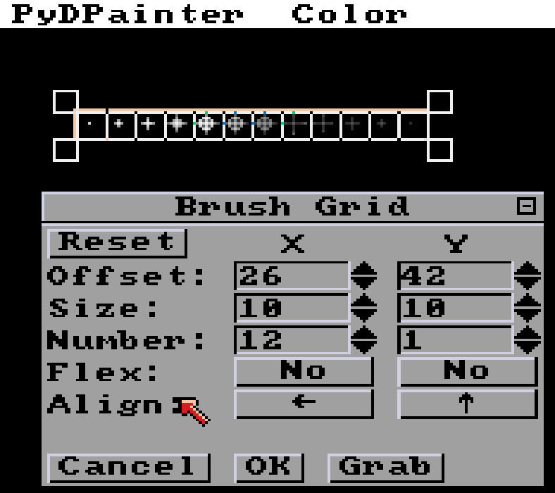
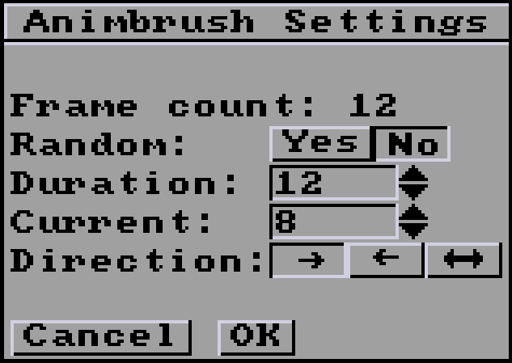
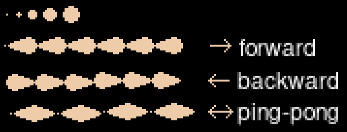

# Anim Menu

A new set of animation features were added in PyDPainter 2.x.

_Note : PyDPainter aims to implement all the animation features from the Amiga version of Deluxe Paint III. On this foundation, enhancements such as GIF support and multi-palette mode are being added to better support more modern formats._

- [**General principles**](#general-principles)
- [Open...](#open)
- [Save...](#save)
- [Move...](#move)
- [Frames](#frames)
  - [Import...](#import)
  - [Export...](#export)
  - [Set #...](#set-)
  - [Copy to all](#copy-to-all)
  - [Add Frames](#add-frames)
  - [Delete Frames](#delete-frames)
  - [Delete All](#delete-all)
- [Control](#control)
  - [Set Rate...](#set-rate)
  - [Previous](#previous)
  - [Next](#next)
  - [Go to...](#go-to)
  - [Play](#play)
  - [Play once](#play-once)
  - [Ping-Pong](#ping-pong)
- [Anim Brush](#anim-brush)
  - [Open...](#anim-brushopen)
  - [Save...](#anim-brushsave)
  - [Grab Frames](#anim-brushgrab-frames)
  - [Grab Grid](#anim-brushgrab-grid)
  - [Settings](#anim-brushsettings)
  - [Previous](#anim-brushprevious)
  - [Next](#anim-brushnext)

## General principles

An animation is a sequence of **frames**. Each frame is like an individual image on which you can draw independently. Animation is therefore the more or less rapid succession (see Control rate) of frames that produces an optical illusion of movement. In reality, nothing really moves. Think of it like the drawings on the bottom of a notebook that you flip through rapidly with your thumb. This is the same way that early cartoons were drawn. Because of this principle, animation has a few limitations (which are those of the Deluxe Paint era):

- Screen size (Screen Format; Screen Size) cannot be changed during animation.
- The maximum number of colors displayed cannot be changed during animation. If you have a 16-color frame, the next frame cannot have 256 colors. If you need 256 colors on a given frame, the entire animation must be in 256 colors. Fortunately, you are no longer dependent on the memory limitations of the old days, unless you intend your work to be played back on a real Amiga.
- The palette can change during animation (Local Mode), but it's simpler if it's the same everywhere (Global Mode).
- Most functions will draw on the current frame and not on the whole animation (except CLR and the forthcoming Move Requester). PyDPainter works best with frame-by-frame drawing.
- The maximum number of colors, even in the later Amiga's AGA graphics, is 256. PyDPainter is not, and will never be, a modern 16 million-color video or animation editor. You need to understand the "retro" spirit that draws creativity from the limitations of the time. The use of a limited number of colors allows for very particular effects and styles. It's also easier to draw this way. You can watch many examples on :
https://www.randelshofer.ch/animations/amiga.html

## Open...

This loads an animation in the following formats:
- Animated Gif (2 to 256 colors)
- ANIM5 (Amiga), from 2 to 256 colors
- _coming soon:_ ANIM8 (Amiga), from 2 to 256 colors

_Note that since the Amiga doesn't need the .anim file extension to recognize a file, you may come across ANIM files with no extension._

The Amiga's HAM mode (4096 simultaneous colors with constraints) is not and will not be supported, unless converted to 256 colors.

### Makedir

This button lets you create a directory without switching to your file manager. When you're working with a series of images, it's really handy!

## Save...

PyDPainter allows you to save your animations in the following formats:
- Animated Gif (2 to 256 colors)
- ANIM5 (Amiga), from 2 to 256 colors
- _coming soon:_ ANIM8 (Amiga), from 2 to 256 colors

_There's no such thing as a "work project", this saving only includes frames. So don't forget to save your draft page (j) as an image and the brushes you've used. in the_ `Brush / Save as` _Menu._

## Move...

The "move requester" is a powerful function that lets you move a brush throughout the animation, on the x, y and even z axes (perpective and rotation).
It will be implemented in the near future.

## Frames

### Import...

PydPainter can also load a sequence of numbered images. For example:
- `myanim_001.png` to `myanim_200.png`
- `01.iff` to `12.iff`

You can, for example, load frame-by-frame renderings from other software, such as 3D or a series of scanned drawings.

PyDPainter can handle up to 9999 frames, but it can become very slow with that many frames.

### Export...

Exports all frames of the animation as a numbered sequence of still images in the following formats:
- BMP (Windows bitmap)
- JPEG (lossy photo format)
- GIF (single frame GIF images)
- IFF (Amiga Deluxe Paint format)
- LBM (PC Deluxe Paint format)
- PNG (popular modern format)

It's best to export images into their own folder using the `Make Dir` button to avoid having hundreds of numbered files mixed in with others in a directory.

### Set #...
Sets the number of frames.  
_Ten frames may be enough for a test run. Remember that old cartoons use less than 15 frames per second._

### Copy to all
Copies the drawing of the current frame to all other frames.

### Add Frames
Adds one or several frames after the current frame. By doing so, it copies the contents of the frame currently displayed.

### Delete Frames
Delete this frame or several frame after the current frame.
_Please note that undo will not cancel this action._

### Delete All
Delete all frames, thus delete current animation and remove animation nav bar below.

## Control

Note that a navigation bar appears at the bottom of the screen whenever an animation is loaded or created. This "navbar" can be retracted using the `F10` key.

### Set Rate...
Defines the number of frames per second. This is the speed of your animation. At the time, it was not uncommon to see game intro or animation at 12 or 15 frames per second, for reasons of disk or memory space. Remember, your work will be better appreciated if people have time to look at it.

This speed can be global (for the whole animation) or local (the animation can speed up, for example, or remain "paused").

### Previous
Go back to the previous frame (if you're at frame 20, go back to 19). 
Keys `1` or `PageUp`

### Next

Go to next frame (if you're at frame 20, go to 21). 
Keys `2` or `PageDown`

### Go to...

Goes directly to the frame number you specify. If this number is greater than the total number of frames defined by [Set #...](#set), this just takes you to the last frame. 
Key `3`

### Play
Plays the animation in a loop. When it reaches the last frame, it starts again without interruption. 
Key `4` 
Hit `ESC` or `SPACE` to stop.

### Play once
Plays the animation once. Once it reaches the last frame, it stops. 
Key `5`

### Ping-Pong
Play the animation in the normal direction (from the first to the last frame), then in the opposite direction, and start again. 
Key `6`

## Anim Brush

Brushes become animated in this powerful feature that lets you draw with an animation.
When using an anim brush, each time it draws on the canvas, it automatically advances to the next frame in the anim brush.

Anim brushes can be used in two main ways:

* in an animation - Use them like sprites such as a spinning wheel or a character walking across the screen.
* in a static picture - Use them to make randomized leaf textures or varying shapes along a line.

In fact, an anim brush can be used just like a normal brush with any of the drawing tools: dot, freehand draw, line, rectangle, circle and even ellipse.

See the [anim brush tutorial](../../tutorials/src/animbrush/animbrush.md) for some more ideas.

You can even combine anim brushes with anim painting for more possibilities.
See the [anim painting tutorial](../../tutorials/src/animpainting/animpainting.md)
to see how anim painting works and try using an anim brush instead of the normal
brush used in the tutorial.

_Note that anim brushes support only one palette for the entire sequence of anim brush frames._

### Anim Brush/Open...

This loads an anim brush in the following formats:

- Animated GIF:
  - 2 to 256 colors
  - has transparency only if saved from PyDPainter
- ANIM (IFF ANIM5 on Amiga):
  - 2 to 256 colors
  - no transparency
- ANBR or ANIB (IFF anim brushes on Amiga)
  - 2 to 256 colors
  - transparency supported

If the loaded anim brush has a different color palette than the current picture,
the colors can look strange. If you want to use the anim brush with the correct
colors, you have some options:

- Use the **Brush/Remap** menu option to modify the anim brush to fit the colors in the current palette. This will preserve the current picture's color palette but possibly make the anim brush look wrong if the colors don't match well.
- Use the **Picture/Change Color/Use Brush Palette** menu option to set the current picture's palette to the anim brush's palette. This will make the anim brush look right, but anything in the current picture will have the wrong colors.
  - Afterward use the **Picture/Change Color/Remap** to modify the current picture to find the closest colors to match the palette that was loaded with the anim brush that you previously applied.

_Note that since the Amiga doesn't need the file extensions to recognize a file, you may come across ANIM or anim brush files with no extension._

### Anim Brush/Save...

PyDPainter allows you to save your anim brushes in the following formats:

- Animated GIF:
  - 2 to 256 colors
  - has transparency only if loaded back into PyDPainter
- ANIM (IFF ANIM5 on Amiga):
  - 2 to 256 colors
  - no transparency
- ANBR or ANIB (IFF anim brushes on Amiga)
  - 2 to 256 colors
  - transparency supported

_Note: you must have a brush with more than one frame to save it as an anim brush.
To save a brush with a single frame, use the [Brush menu Save](brush.md#save-as)._

### Anim Brush/Grab Frames

This menu option allows you to choose a rectangle area from each frame in an animation and creates an anim brush out of it.

Step-by-step operation:

1. Choose the **Animation/Anim Brush/Grab Frames** menu option.
2. The mouse pointer is now extended by two white alignment lines with moving dots, which are superimposed on any graphics in the drawing area.
3. Click on a corner of the selection area, **keep the button down**
4. Drag the mouse to the opposite corner.
5. Release the button.
6. This area is now captured from each frame in the animation into your new anim brush.

Key `alt-b`

### Anim Brush/Grab Grid...

The **Grab Grid** menu option creates an anim brush from a series of cells in a
grid that you select from the current picture.  This could be a sprite sheet or
a similar series of images in a single picture.

Hotkey: `alt-g`

Choosing the **Animation/Anim Brush/Grab Grid...** menu option brings up this requestor:

This requestor controls the grid of cells that will turn into an anim brush.

- The **Cancel** button leaves the requestor and does not save changes to the values.
- The **OK** button leaves the requestor but also saves the values.
- The **Grab** uses your settings to create an anim brush out of the cells you specified.

*Tip: you can move the requestor if it obscures the area you need to work on. Inside the title bar, the* `[-]` *button also lets you collapse it.*

Here are the settings you can control:

#### Reset button

This button puts the brush grid back to a default setting in case you messed up and don't know how to get back.

#### Offset (X and Y)

The **Offset** setting lets you choose the X and Y pixel offset of the upper
left of the grid.  These coordinates are based on (0,0) being at the top left
of the picture.  Use the up/down spinner arrows to move the grid in the X or Y
directions.  You can also click and drag the brush grid to move it to a new
position.

#### Size (X and Y)

The **Size** setting specifies the width and height in pixels of each cell in
the grid. Use the up/down spinner arrows to adjust the size of the cells. You
can also resize the grid in any direction by dragging the corner handles or the
handles that appear along the top, bottom, left, or right when you move the
mouse over that area.

#### Number (X and Y)

The **Number** setting lets you change the number of grid cells in the X and Y
directions. Use the up/down spinner arrows to increase of decrease the number
of cells horizontally or vertically. You can also just enter the number
directly.

#### Flex (X and Y)

Clicking on the **Flex** option toggles the value between "No" and "Yes".  With
"No" flex, the grid is fixed to the size specified above for each of the cells.
If flex is set to "Yes", PyDPainter uses the background color to attempt to
find the edges of the image in a cell. It will show this as a dotted line on
the screen. This can be used for sprite sheets that don't have consistent
spacing between the cells.

_Note: Make sure the background color is set properly to allow empty space to
be detected properly._

#### Align (X and Y)

Clicking on the **Align** arrows in the X direction cycle from left to right to
centered. The Y direction cycles from top to bottom to centered. These
alignments determine the position of the cell when it is smaller than the grid
size because **Flex** in that direction was turned on.

### Anim Brush/Settings...

The **Settings** requestor allows you change how the current anim brush behaves.

#### Frame count

The **Frame count** is the number of frames in the current anim brush.

#### Random

The default for **Random** is to be set to "No" which allows the anim brush
frames to advance one at a time. Setting the **Random** option to "Yes" chooses
a random frame from the anim brush each time it is drawn to the screen. Because
the rest of the settings in the requestor make no sense if the value is set to
"Yes" it ghosts the rest of the values.

#### Duration

The **Duration** value controls how quickly the frames of the anim brush
advance. To change it, use the up/down arrows or type a number in the text
field. If it is set to the same as the frame count, the anim brush changes one
frame each time it is drawn. If the duration is less than the frame count,
frames are skipped to match the duration. If the duration is more than the
frame count, frames are duplicated to match the duration.

#### Current

The **Current** value controls the number of the frame currently shown from the
anim brush. To change it, use the up/down arrows or type a number in the text
field.

#### Direction

The **Direction** arrows allow you to choose the direction the anim brush
frames are advanced: forward, backward, and ping-pong. The following example
shows the frames of a circle airbrush with a line tool dragged from left to
right in forward, backward, and ping-pong modes:

### Anim Brush/Previous

**Previous** moves the anim brush to the previous frame.

Key `7`

### Anim Brush/Next

**Next** moves the anim brush to the next frame.

Key `8`
