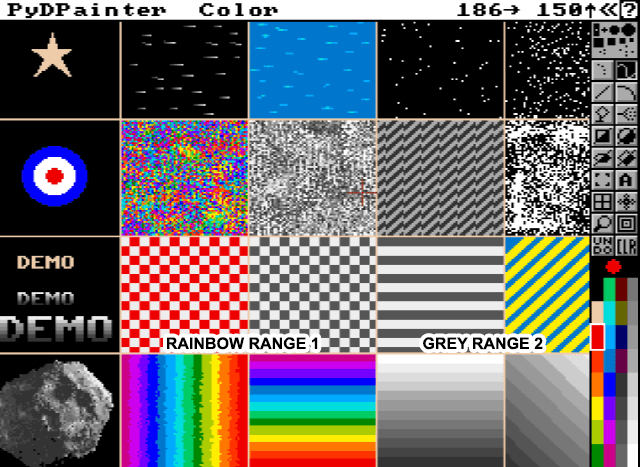
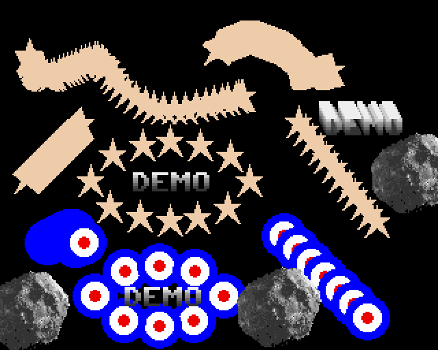
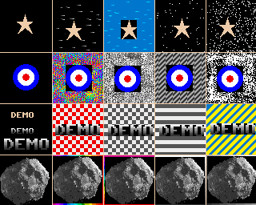
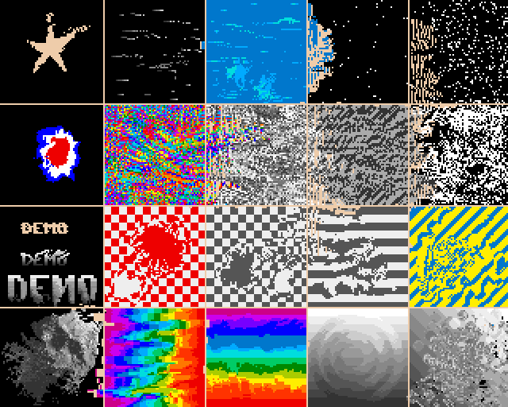
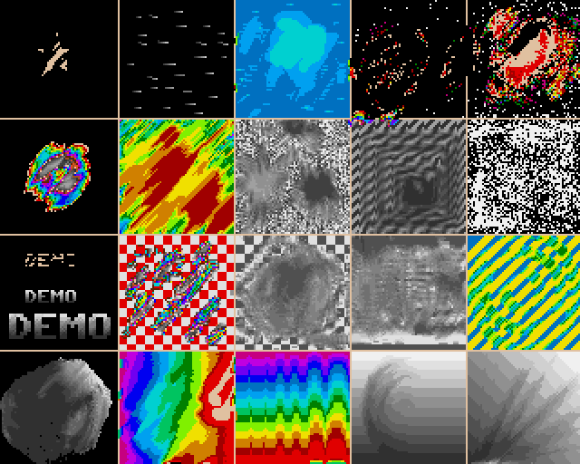
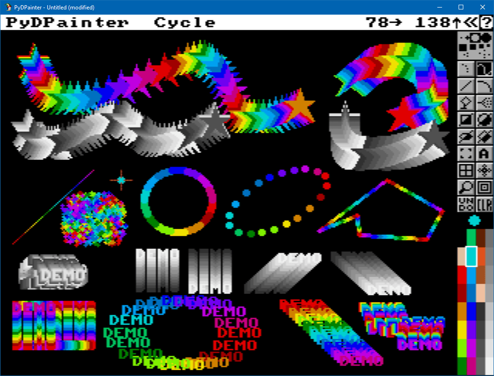
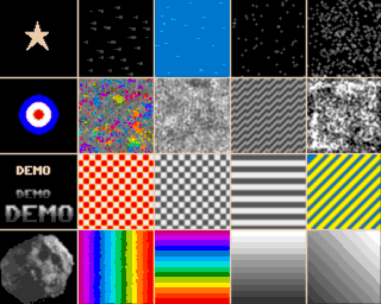
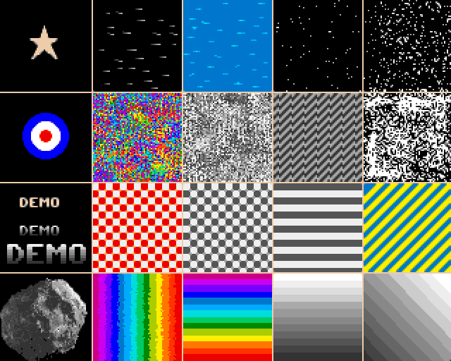
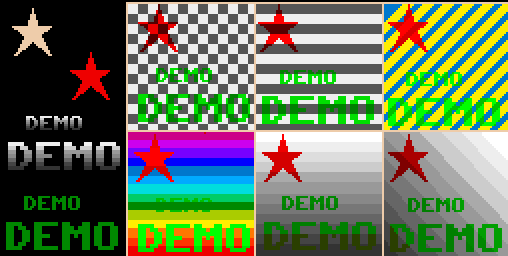

# Mode Menu

The Mode menu contains options for different brush modes.
- [Matte](#matte)
- [Color](#color)
- [Repl](#repl)
- [Smear](#smear)
- [Intro to Cycle Ranges](#cycle-range)
- [Shade](#shade)
- [Blend](#blend)
- [Cycle](#cycle)
- [Smooth](#smooth)
- [Tint](#tint)
- [Hbrite](#hbrite)

_Note: With the exception of **Shade Mode**, the right mouse button always paint using current background color (black by default) in Color Mode. So use left button to use theses Mode._

To help you visualize the action of all these modes, we've used all or part of this image in our graphic examples:  

  

_For examples, we use the first column (star, target, text, asteroid) as custom brushes._

## Matte
Uses a custom brush in its original form. Those areas of the brush
matching the background color in effect when the brush was first
created are transparent. _note: black by default_. This is the default mode activated when you create a custom brush using the Brush Selector. Now you can draw using this brush in all drawing tools.  

  
  _Try to explore all drawing tool parameters for interesting effects._

Key: `F1`

## Color
Keeps the shape of the brush, but fills it with the current foreground color.
Those areas of the brush matching the background color in effect when
the brush was created remain transparent.
  

All brush colors are replaced by the selected foreground color (in this case red).

Key: `F2`

## Repl
Uses the brush in its original form (i.e., Matte, see above), except that no
colors are transparent.

Key: `F3`

## Smear

You can smear any colors on the page by dragging a brush over them. This is like smearing a wet watercolor with your fingers, so the bigger the brush, the more pronounced the effect. __Smear__ uses only the colors under the brush, and does not add any new colors.
Current brush color is irrelevant, but shape is.

  

Try this with differents shapes and tool to disintegrate, burst, add noise to an overly picture-perfect sketch.

Key: `F4`

## Cycle Range

To understand the following modes, you need to consider the default 32 color
palette. The default palette has two built-in __Cycle Ranges__: a grayscale
range (1) and the famous rainbow range (2) you've seen in most DPaint demos.
Please note that the rainbow range in the examples is expanded to encompass
more colrs than the default range, and that no colors are shared between the
two ranges. These ranges are used in all gradient fill options, Shade, Blend
and Cycle Mode.

Use `Picture/Change Color/Palette` menu or hit `p` to check, edit or create
Cycle Ranges. Click on __1__ to __6__ __Range__ buttons to check if any
preexisting Cycle Range. To define a new Cycle Range: Select a number,
select first color, click on __Range__, then choose your last color.

## Shade

You can create subtle shading effects on those colors in your picture that are
in a [cycle range](#cycle-range). Like [Smear](#Smear) (above), __Shade__
ignores the current brush color but uses its shape. By dragging the brush over
those colors in your picture that are in a currently selected [cycle
range](#cycle-range), you can paint over each color with the next color in the
range. You can paint with the next-higher color by using the left mouse button,
and the next-lower color by using the right mouse button.  "Higher" and "lower"
are relative to the color under the brush at the time. If the current
foreground color is in a [cycle range](#cycle-range), __Shade__ has no effect
on colors outside that range. If the current foreground color is not in a
[cycle range](#cycle-range), __Shade__ treats the entire palette as a cycle
range. (A range is selected if one of its members is selected as the foreground
color. A color that is a member of two ranges selects the first of those two
ranges.)

  

This mode lets you create visual effects such as false colors, superimposed
shapes and bevels to highlight a shape.

Key: `F5`

## Blend

Like [Smear](#Smear), above, __Blend__ affects the colors under the brush by
running them together. Unlike Smear, however, __Blend__ uses additional shades
by averaging the blended colors, whereas Smear uses only the colors under the
brush. Thus, when you __Blend__ two shades by painting over them, you are
selecting a third shade from the palette, the closest one the program can find
to the average of the two original shades. If you select a foreground color
outside of a [cycle range](#cycle-range), __Blend__ treats the entire palette
as a cycle range. If you select a color within a [cycle range](#cycle-range),
__Blend__ only affects those colors on the screen that are within that range.

  

Depending on the brush used, the color underneath, the color cycle selected or
not, and the direction of your movement, results can vary greatly.

Key: `F6`

## Cycle

Uses the current brush shape and cycles through all the colors in the currently
selected range as you draw. A [cycle range](#cycle-range) is selected if one of
its members is selected. If a color is a member of two ranges, selecting it
selects the first of those two ranges. If your current brush color is not
within a [cycle range](#cycle-range), it paints with that color only.

This mode is one of the most creative tools in software such as
PyDPainter/DPaint.This kind of easy-to-use effect is not found in modern tools.

Hit `TAB` to cycle colors _(Another very retro effect)_.

Key: `F7`

## Smooth

Reduces the contrast between two adjoining areas. PyDPainter finds colors in
the palette between the two bordering colors and paints the boundary in
intermediate shades. __Smooth__ looks at the current palette and finds the
colors closest to the ones under the brush. Thus if the palette contains a wide
selection of colors close to the ones under the brush (e.g., the selection of
greys in the default palette), it will have more colors to choose from to
create its weighted averages. Useful for smoothing out contrasting boundaries,
or for eliminating jagged edges.

  
__Smooth mode__.

_Note: This mode is now available in PyDPainter in all Fill tools too. In
addition, we've added a new, more accurate smoothing mode, __AntiAliasing__,
only available in Fill tools. To use them, select the `Smooth` or
`Antialiasing` buttons in any fill tool parameters (right-click on the
bottom-right half icon of any drawing/filling icon) and fill an area of your
picture._

  
__AntiAliasing__ fill samples. Less blury, more accurate for aliasing.

Key: `F8`

## Tint

Uses the hue of the selected foreground color to __"tint"__ the colors below as
you are drawing. Replaces the hue and saturation of the affected pixels with
the current color but leaves the value of the screen pixels unaffected.  _Note:
Works best with 256 colors or with a palette designed for this purpose. Do not
try on black background._  

  

__Tint__ examples, using a star brush with red foreground color and DEMO brush
in green foreground color. Only the shape of the brush is used. The brush's
original colors are ignored.

Key: `F9`

## HBrite
_not implemented yet_

**Extra Half-Brite** (EHB) was a graphics mode on the Commodore Amiga computer.
It uses six bit planes, i.e. 6 bits per pixel, where the first five bits
represent the index of a color in a 32-color palette (25). The sixth
bit indicates that the color is that of the palette indicated by the first five
bits, but with light intensity halved.  The title screen of the game ["Full
contact" by Team
17](http://www.randelshofer.ch/animations/anims/team17/FullContact_Intro.anim.html)
used this mode, as did the  ["HalfBrite Hill" by Kevin Sullivan's
demo](http://www.randelshofer.ch/animations/anims/electronic_arts/HBriteHill.html)

When you are in **HBrite** mode, painting with the left mouse
button darkens colors on your painting to their halfbrite equivalent;
painting with the right button lightens colors that are halfbrite. This
mode is especially useful to animate pictures with shadow or highlight effects.
