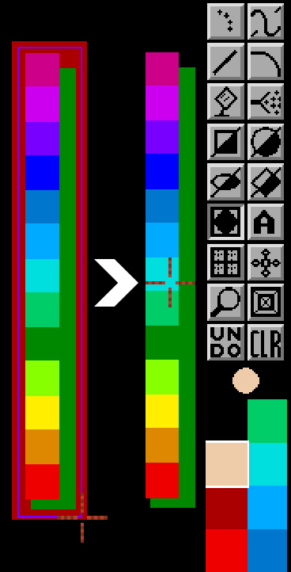
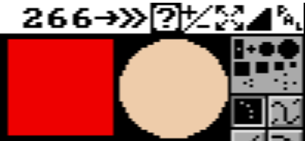
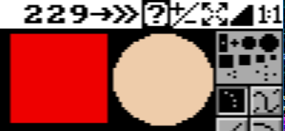
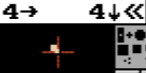

# Prefs Menu

_needs proofreading and informations by Mark..._

This section allows you to adjust the default behavior of some functions to your liking.

Changes are effective immediately. They will not be remembered the next time **PyDPainter** is launched, unless you click on `Save Config`.

An active setting is preceded by a checkmark &check;.

- [Auto Transparency](#autotransp)
- [Hide Menus](#hide-menus)
- [PAL / 1:1 Pixels switch](#force-11-pixels)
- [True Symmmetry](#true-symmetry)
- [Coordinates](#coords)
- [Save Configuration](#save-config)

## AutoTransp
Ignores the current palette background color to define brush transparency.  Automatically uses instead the color of the 4 points at the corner of the capture rectangle at the moment the brush tool is used.
If the four corners are the same color, that color becomes the transparent color, otherwise the current background color remains the transparent color.

Example: the palette background color is set to black. But with AutoTransp active, the brush takes this dark red as transparency.

## Hide Menus
Menus at the top no longer appear automatically when the mouse is positioned over them. (I don't understand the use of this ???)

Note: Press `F10` to remove and redisplay the menus and bar.
## Force 1:1 Pixels
Because the Amiga's pixels are not perfectly square, circles and squares
drawn with the shape tools are not perfectly round or square. If you wish
to draw "true" circles or squares, select this option from the Prefs menu.
Or use the small 1:1 / PAL icon on top right menubar.

(is that the same behaviour ??? Please check)

Amiga legacy **PAL** elongated pixels (first) VS **1:1** pixels (second)

## True Symmetry

???

## Coords

Displays mouse x and y coordinates in the menu bar. When drawing rectangles, circles, ellipses and brushes selection, the coordinates are replaced by the distance in pixels between the point of origin and your mouse position.  

### Show
Activated by default, you can switch this option off/on here or press `|` on the keyboard (hit `alt-6`).
### Flip
Inherited from the Dpaint Amiga version, these coordinates are 0 and 0 at bottom left. As the current convention is top left, Flip allows this.
### 1-based
The 1-based option starts the count at 1 rather than 0.

*Note that part of your work page may be hidden under the menus at the top, and on the right under the toolbar. Press F10 to remove the menus, or use the arrow keys to drag your work area.*

## Save Config
Save these choices in the ??? file for the next time you start **PyDPainter**.
If you wish to re-initialize the preferences, ???