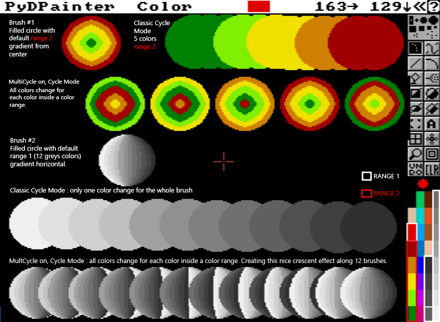
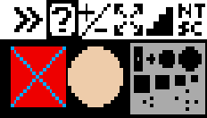
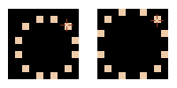
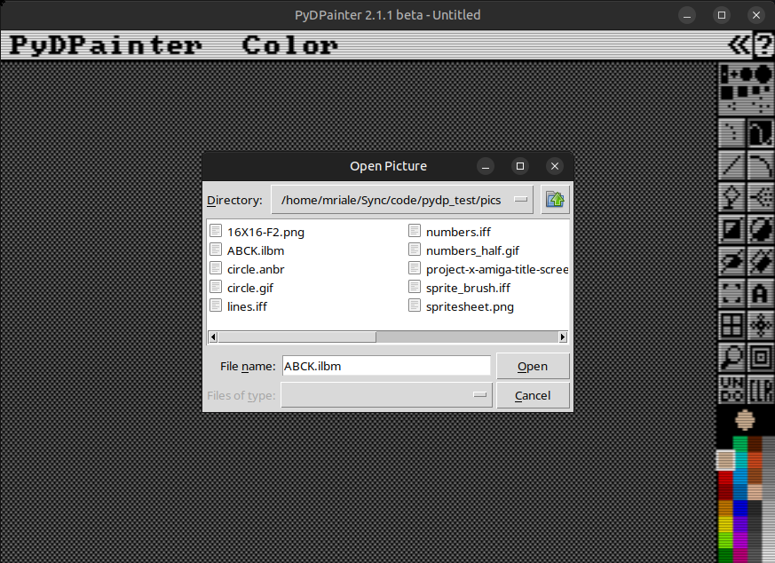

# Prefs Menu

This section allows you to adjust the default behavior of some functions to your liking.

Changes are effective immediately. They will not be remembered the next time **PyDPainter** is launched, unless you click on `Save Config`.

An active setting is preceded by a checkmark &check;.

- [Prefs Menu](#prefs-menu)
  - [AutoTransp](#autotransp)
  - [MultiCycle](#multicycle)
  - [ExclBrush](#exclbrush)
  - [Hide Menus](#hide-menus)
  - [Force 1:1 Pixels](#force-11-pixels)
  - [True Symmetry](#true-symmetry)
  - [SysFileDialog](#sysfiledialog)
  - [Coords](#coords)
    - [Show](#show)
    - [Flip](#flip)
    - [1-based](#1-based)
  - [Save Config](#save-config)

## AutoTransp
When this setting is on, PyDPainter ignores the current palette background color when grabbing a brush and uses instead the color of the 4 points at the corner of the brush capture rectangle.
If the four corners are the same color, that color becomes the transparent color, otherwise the current background color remains the transparent color.

Example: the palette background color is set to black. But with AutoTransp active, the brush takes this dark red as transparency.

## MultiCycle
By default, Cycle mode `F7` uses the overall shape of the current brush, like in Color Mode, but cycles colors along the active range. Pixel colors in any custom brush are not taken into account.
With this option ON, all brush pixels are taken into account, and if they are in a Range, their colors will cycle individually. If the brush contains pixels belonging to several Color Ranges, they will all cycle.

In this example, we use the two default ranges when the PyDPainter program opens. As you can see, Multicycle produces remarkable effects. Without, the whole shape turns red, then yellow, then green, or through grays and that's it.

*Note: if a brush were to use both gray pixels from Range 1 and yellow or green pixels from Range 2, both would cycle.*

Follow thoses links if you're not familiar with [Color Range](mode.md#cycle-range) or [Cycle Mode](mode.md#cycle).

## ExclBrush
If you pick up a brush with ExclBrush (and the Grid) selected, you will exclude
a one-pixel border on the right and bottom edges of your brush. This is useful
if your brush has a colored border around it and you want to use the brush to
create a pattern fill or perspective fill (using the Fill Type requester). When
PyDPainter creates your pattern, the border will be uniform throughout instead
of being twice as wide where one copy of the brush is placed next to another.

## Hide Menus
Menus at the top no longer appear automatically when the mouse is positioned over them. This emulates the way the Amiga menus did not appear until the right mouse button was pressed.

## Force 1:1 Pixels
This option forces PyDPainter to display only square pixels even when dealing with PAL or NTSC screen modes. Since modern displays have square pixels, this makes the all the pixels uniform when scaling to a modern display.

The pictures below show the non-square pixels and the resulting scaling artifacts of **NTSC** and **PAL** modes vs **1:1** pixels: 
 
 

## True Symmetry
Screen sizes are usually even numbers (like 320x200) which means there is no true center pixel to use with the symmetry tool. True Symmetry forces the center to half-pixels so the center of the symmetry is in the actual center of the screen.

This can be seen with a small 10x10 page size. On the left is regular symmetry and the on right is True Symmetry: 

## SysFileDialog
By default, PyDPainter uses its own file requester, inspired by Deluxe Paint. If you prefer your modern OS's file dialog window with support for thumbnail previews, shared drives, and different volumes, you can check this option. This works for all menu items that open and save. When the modern file dialog window is shown, PyDPainter will be completely frozen, waiting for you to pick a file or cancel. To remind you of this, it displays a checkerboard pattern on top of the canvas in PyDPainter.

 
*Open Picture with the system file dialog on Linux*

*Note: Because full screen mode (`F11`) takes over the screen, the system file dialog window can easily be lost behind the PyDPainter window with no easy way to get it back. Therefore, the SysFileDialog option will be ignored in full screen mode.*

## Coords
Displays mouse x and y coordinates in the menu bar. When drawing rectangles, circles, ellipses and brushes selection, the coordinates are replaced by the distance in pixels between the point of origin and your mouse position.  

### Show
You can switch this option on and off in the Prefs menu or press `|` on the keyboard.

### Flip
In PyDPainter, the coordinates normally start at (0,0) in bottom left. When the Flip option is selected, it maps (0,0) to the top left.

### 1-based
The 1-based option starts the coordinates at (1,1) rather than (0,0).

*Note that part of your work page may be hidden under the menus at the top, and on the right under the toolbar. Press F10 to remove the menus, or use the arrow keys to move your work area.*

## Save Config
Save these choices in the config file for the next time you start **PyDPainter**.
If you wish to re-initialize the preferences, delete the `.pydpainter` file in your home directory.

###### Documentation written by Stephane Anquetil
