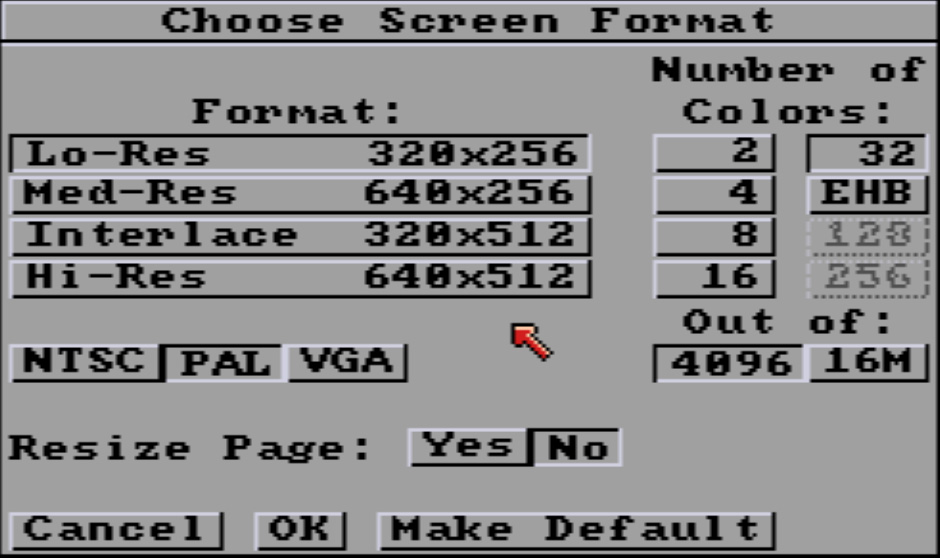
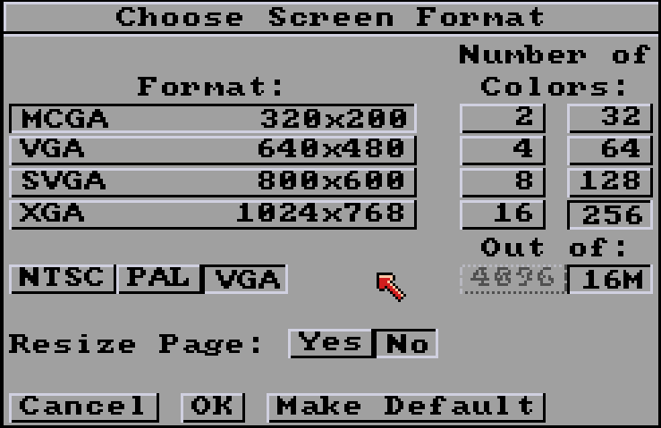

# Screen format

- [Screen format](#screen-format)
  - [What is a screen format?](#what-is-a-screen-format)
  - [Tools bar and menu](#tools-bar-and-menu)
  - [Quick tutorial : displaying Kingtut.](#quick-tutorial--displaying-kingtut)
  - [Format:](#format)
  - [Systems](#systems)
    - [NTSC and PAL](#ntsc-and-pal)
    - [VGA](#vga)
    - [Lo-Res](#lo-res)
    - [Med-Res](#med-res)
    - [Interlace](#interlace)
    - [Hi-Res](#hi-res)
  - [Number of colors](#number-of-colors)
  - [Out of](#out-of)
    - [4096](#4096)
    - [16M](#16m)
  - [Resize Page](#resize-page)
- [Bottom buttons](#bottom-buttons)
    - [Cancel](#cancel)
    - [OK](#ok)
    - [Make Default](#make-default)

## What is a screen format?

Imagine you are drawing a picture using tiny colored squares, called pixels. The more squares you use, the more detailed your picture can be. This is what we call "screen resolution" - it's the number of tiny squares that make up the images on a computer screen. But increasing the number of pixels has a cost: you need the graphic memory to store them, the storage to save them, the screen to display them, and the power to animate them in games or even animations. In the 80s and 90s, none of this was obvious.
A long time ago, when people played games on computers like the Amiga, Atari ST, or early PCs, the screens didn't have as many pixels as today. For example:
- On the Amiga and Atari ST, many games used a screen resolution of 320 pixels wide and either 200 or 256 pixels high. Most demos and games used this low resolution because it offered the most colors.
- These computers used higher resolutions for things like word processing or music programs, but fewer colors were available in these modes.
- Early PCs, like those using VGA graphics, had a mode with 320 by 200 pixels and 256 colors, or 640 by 480 pixels with 16 colors.

*The iconic Tutankhamun mask used as cover for many Deluxe Paint versions. 320x200 NTSC picture in 32 colors by Avril Harrison.*

It's these screen modes that form the basis of **PyDPainter**, even if it may seem obsolete, because this program is first and foremost a recreation of **DeluxePaint III**, as it was conceived at the time.

Because there weren't many pixels and colors, artists made beautiful pictures and characters using what is now known as "pixel art." Pixel art is when you create pictures by carefully choosing the color of each little square. It's like making a mosaic with beads or LEGO blocks, where every piece counts!

Even though these pictures were not as realistic as modern photos and video games, they had their own special charm. Artists used clever tricks to make the images look lively and colorful, even with just a few pixels and colors. For example, games by Bitmap Brothers or Psygnosis on the Amiga are still remembered for their amazing pixel art.

That's why pixel art and low-resolution graphics are timeless - they're beautiful in their own way, and they remind us of how creative people can be, even with simple tools! **PyDPainter** is the ideal tool for getting started with pixel art or studying how it was done back in the day.

## Toolbars and menus

Another important legacy is that, at the time, screens and resolution were not large enough to distinguish the working document from the interface. Today, you work with tool palettes and menus that you place wherever you want, independently of your open documents. In **PyDPainter**, the toolbar on the right and the menus follow your screen resolution. And, as in the old days, part of the canvas you can draw on is 'underneath' the toolbars and menus.

*Original Amiga with a real CRT screen displaying Deluxe Paint with its tool and menu bars.*

*Full picture (640x256 px aka Med-Res)*
## Quick tutorial : displaying Kingtut.

1. Go at [Amiga Lychensis Archive](https://amiga.lychesis.net/applications/DeluxePaint.html). Select Applications, Deluxe Paint. Scroll down to the middle of the page, locate the King Tutankhamun picture.
2. Click on the IFF download icon on the upper right and save the `AH_KingTut.iff` Amiga file on your computer.
3. Locate it and load it into **PyDPainter**, using Drag'n'Drop or the **"Picture / Open..."** menu.
4. If you look closely at the image of KingTut again, the menu bar at the top hides the upper part of the image. Scroll with the `Up` and `Down` Keys of your keyboard.
5. Use the `F10` key to try it. It hide and switch the toolbars.
6. Hit the `F12` key to browse through the CRT and antialiasing screen emulation options. Identify the display you prefer.
7. Check the **Picture / Screen Format...**. It displays the current Screen Format. Lo-Res 320x200 (NTSC), 32 colors out of 4096 (Legacy Amiga).

9. Hit Cancel.

## Format:
The list is updated according to the **system** display selected by the 3 buttons at the bottom. A choice from this list may restrict the **Number of Colors** on the left.

## Systems
**PyDPainter** allows you to choose from the Amiga (OCS/ECS) modes from Deluxe Paint III plus Amiga AGA modes, and PC VGA modes.

### NTSC and PAL
**NTSC** was the video signal standard for TV broadcasting in North America and Japan while the **PAL** standard was used pretty much everywhere else in the world. In progressive scan mode, the visible area is limited to 200 lines in NTSC, or 256 lines in PAL. The pixels are not quite square and the aspect ratio varies between the two standards.
While most retro computers used low resolution progressive scan for stable displays, the Amiga could also use interlacing to double the vertical resolution. This was achieved by drawing odd lines on one screen refresh and even lines on the next. This could introduce a lot of flickering on some images. This flickering is **not** emulated by PyDPainter because it was one of the annoying things best left in the past.
The NTSC/PAL settings in PyDPainter affect the size and squareness of the pixels. More info about [Amiga Screen modes](https://amiga.lychesis.net/articles/ScreenModes.html).

| Name | Resolution in pixels (NTSC) | Resolution in pixels (PAL) | Colors (Out of 4096) | Colors (Out of 16M) |
| --------- | ------- | ------- | --------------------- | --------------- |
| Lo-Res    | 320x200 | 320x256 | 2 to 32 colors or EHB | 2 to 256 colors |
| Med-Res   | 640x200 | 640x256 | 2 to 16 colors        | 2 to 256 colors |
| Interlace | 320x400 | 320x512 | 2 to 32 colors or EHB | 2 to 256 colors |
| Hi-Res    | 640x400 | 640x512 | 2 to 16 colors        | 2 to 256 colors |

The main Amiga formats are supported, from 2 up to 256 colors. If you want to relive the experience and constraints of an Amiga 500, 600, 1000, 2000, or 3000, stick with **4096** colors palette. If you prefer to use 256 colors or see what an Amiga 1200 or 4000 could do, press **16M** (16,777,216 colors, which is the same as modern computers).

The Amiga also had a mode that allowed 4096 colors at the same time on screen, known as **HAM** (Hold And Modify). Although very impressive for 3D renderings, photo scans and slide-shows, it had constraints which produced the color smears, typical of this mode. This graphic mode will not be natively supported by **PyDPainter**, but it is able to load HAM images and convert them to 256 colors.

### Lo-Res 
This was the resolution of the majority of Amiga (or Atari, SNES) games and demos. The pixels are slightly non-square.
### Med-Res
This was the Workbench's AmigaOS default screen resolution. The pixel has that distinctive narrow 1:2 aspect ratio that allows 80 columns of text to be displayed on each line. If you've experienced it on a real Amiga, it was often limited to 4 colors for reasons of graphic memory size (Chip RAM). All Amiga program icons used this mode.
### Interlace
An ideal format for scans and impressive loading screens, but with the major drawback of flickering horribly on a TV or CRT monitor (which PyDPainter thankfully does not simulate). Pixels are a 2:1 ratio. Remember James Dean's illustration on Shadow of the Beast or the Unreal title screen? That was this screen format!
### Hi-Res
The high-resolution screen. Ideal for word processing, DTP, vector or 3D software, but required a VGA screen with a de-interlacing card to avoid blowing your eyes out. Pixels slightly non-square like Lo-Res, but smaller.

*Hi-Res is double the size of Low-Res, so if you change **Screen Format** to Hi-Res after you've finished your Lo-Res picture and click **Yes** to Resize; it doubles the image size easily.*

## Number of colors
You can choose from 2 up to 256 colors. Even if it can be tempting to choose the maximum of 256 colors, pixel art is the art of constraint. You will learn more and the software will be easier to handle and understand with fewer colors. 32 is a good start so you don't have to keep switching pages on the color palette.

**EHB** is **Extra Half-Bright**, a special Amiga Mode in which the last 32 colors are darker copies (half the brightness) of the first 32 colors. Used in conjunction with **Halfbrite Mode** (_not yet supported_), this drawing mode can be used to draw shadows or apply lighten/darken effects. Unfortunately, only a few games use it: 1990s Super Cars I and II, and 1992s Black Crypt. Agony and Magnetic Field's Lotus Turbo Esprit Challenge 2 use this mode for loading screens. More info at [Amiga Graphics Archive](https://amiga.lychesis.net/articles/ExtraHalfBright.html target:_blank)

## Out of
The Amiga 500/600/1000/2000/3000 (OCS/ECS) had a palette of **4096** colors (which was state-of-the-art at the time of the original launch in 1985). With the AGA chipset introduced in 1992, the Amiga 1200/4000/CD32 introduced **16 million** colors to catch up with technological developments. This is still the standard today, because the human eye has trouble distinguishing more colors than that.
### 4096
In the [Palette](palette.md), each Red, Green, Blue slider has a limited 16 value scale.
### 16M
Modern palette. In the [Palette](palette.md), each Red, Green, Blue slider has a 256 value scale.

### VGA
**VGA** was the screen format used on PCs at the time. All are 2 to 256 colors out of 16 million colors for simplification, even if the older VGA standard only had a palette of 262,144 colors and some modes had other color limitations. If you want to recreate Sierra's King'Quest CGA screens, use MCGA and lower the colors to 16.
Name | Resolution in pixels | Colors
--- | --- | ---
MCGA | 320x200 | 2 to 256 colors
VGA | 640x480 | 2 to 256 colors
SVGA | 800x600 | 2 to 256 colors
XGA | 1024x768 | 2 to 256 colors

## Resize Page
Click **Yes** if you want to resize the current image to the new screen size. For example, if you start with a Lo-Res image and go to Hi-Res, this will double the height and width of the image. Each pixel will become 4 pixels. The sharpness of your drawing will not be automatically increased, but the image will be twice as large (ideal for publishing on a social network).

Click on **No**, if you want to keep the image as it is. This is particularly useful if you want to scale the image from large to small so that it doesn't have to be resized. The image will then be larger than the working screen. See [Page Size](picture.md#page-size), so use the arrow keys to scroll around in it.

# Bottom buttons
### Cancel
Cancel any change. Nothing happens.
### OK
Use the new Screen Format. Current picture may be altered, depending of your choice (less colors, smaller, bigger, etc)
### Make Default
Save to use this Screen Format each time **PyDPainter** is launched or the **New... Picture** menu is used.

###### Documentation written by Stephane Anquetil
