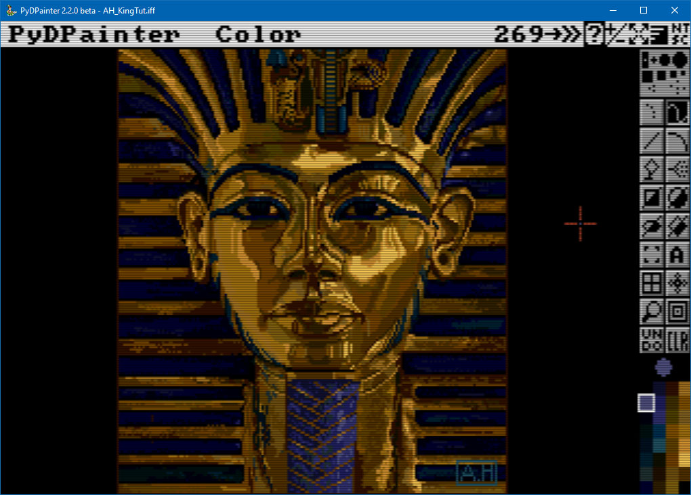
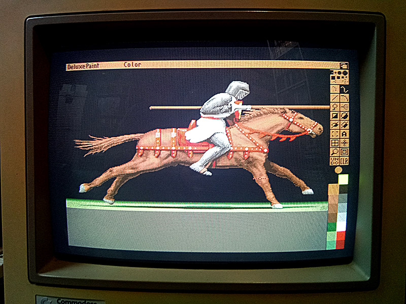
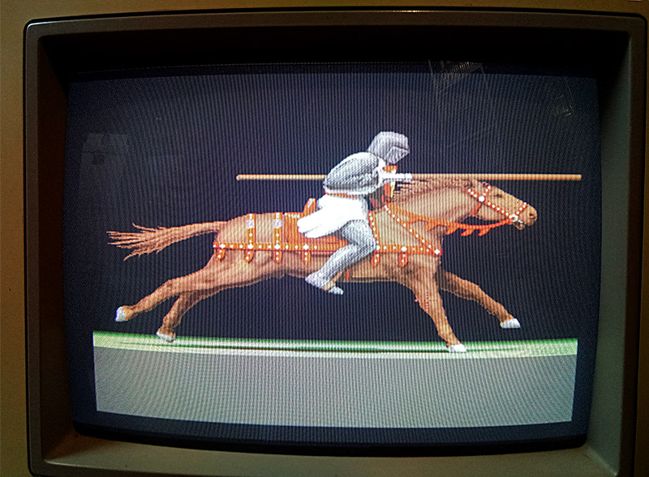
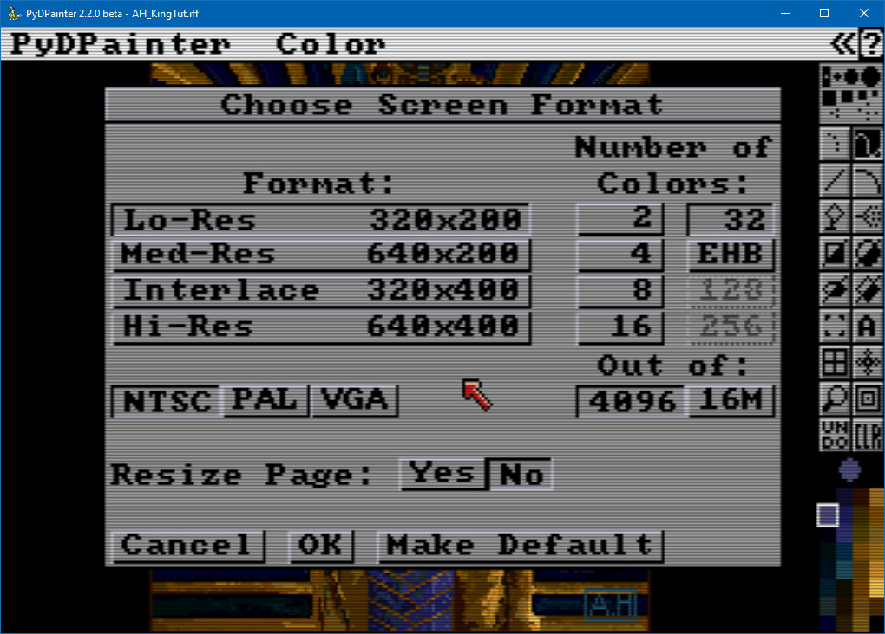

# Screen format

_Work in progress..._

- [Screen format](#screen-format)
  - [What is a screen format ?](#what-is-a-screen-format-)
  - [Tools bar and menu](#tools-bar-and-menu)
  - [Quick tutorial : displaying Kingtut.](#quick-tutorial--displaying-kingtut)
  - [Format:](#format)
  - [Systems](#systems)
    - [NTSC](#ntsc)
    - [PAL](#pal)
    - [VGA](#vga)
    - [Lo-Res](#lo-res)
    - [Med-Res](#med-res)
    - [Interlace](#interlace)
    - [Hi-Res](#hi-res)
  - [Number of colors](#number-of-colors)
  - [Out of](#out-of)
    - [4096](#4096)
    - [16M](#16m)
  - [Resize Page](#resize-page)
- [Bottom buttons](#bottom-buttons)
    - [Cancel](#cancel)
    - [OK](#ok)
    - [Make Default](#make-default)
          - [Documentation written by Stephane Anquetil](#documentation-written-by-stephane-anquetil)

## What is a screen format ?

Imagine you are drawing a picture using tiny colored squares, called pixels. The more squares you use, the more detailed your picture can be. This is what we call "screen resolution"—it’s the number of tiny squares that make up the images on a computer screen. But increasing the number of pixels has a cost: you need the graphic memory to store them, the storage to save them, the screen to display them, and the power to animate them in games or even animations. In the 80s and 90s, none of this was obvious.
A long time ago, when people played games on computers like the Amiga, Atari ST, or early PCs, the screens didn’t have as many pixels as today. For example:
- On the Amiga or Atari ST, many games used a screen resolution of 320 by 256 pixels. That means the screen was made up of 320 little squares across and 256 down.
- It used 320 by 200 pixels for most demos and games, though it could go higher for things like writing or music programs, but with fewer colors.
- Early PCs, like those using VGA graphics, had a mode with 320 by 200 pixels and 256 colors, or 640 by 480 pixels with 16 colors.

*The iconic Tutankhamun mask used as cover for many Deluxe Paint versions. 320x200 NTSC picture in 32 colors by Avril Harrison.*

It's these screen modes that form the basis of **PyDPainter**, even if it may seem obsolete, because this programme is first and foremost a recreation of **DeluxePaint III**, as it was conceived at the time.

Because there weren’t many pixels and colors, artists made beautiful pictures and characters using what is now known as "pixel art." Pixel art is when you create pictures by carefully choosing the color of each little square. It’s like making a mosaic with beads or LEGO blocks, where every piece counts!

Even though these pictures were not as realistic as modern photos and videogamess, they had their own special charm. Artists used clever tricks to make the images look lively and colorful, even with just a few pixels and colors. For example, games by Bitmap Brothers or Psygnosis on the Amiga are still remembered for their amazing pixel art

That’s why pixel art and low-resolution graphics are not just old—they’re beautiful in their own way, and they remind us of how creative people can be, even with simple tools! **PydPainter** is the ideal tool for getting started with pixel art or studying how it was done back in the day.

## Tools bar and menu

Another important legacy is that, at the time, screens and resolution were not large enough to distinguish the working document from the interface. Today, you work with tool palettes and menus that you place wherever you want, independently of your open documents. In **PydPainter**, the toolbar on the right and the menus follow your screen resolution. And, as in the old days, you can draw ‘underneath’. 

*Original Amiga with a real CTR screen displaying Deluxe Paint with its tool and menu bars.*

*Full picture (640x256 px aka Med-Res)*
## Quick tutorial : displaying Kingtut.

1. Go at [Amiga Lychensis Archive](https://amiga.lychesis.net/applications/DeluxePaint.html). Select Applications, Deluxe Paint. Scroll down to the middle of the page, locate the King Tutankhamun picture.
2. Click on the IFF dowload icon and save the .iff Amiga file on your computer.
3. Locate it and load it into **PyDPainter**, using Drag'n'Drop or the **"Picture / Open..."** menu.
4. If you look closely at the image of Kingtut again, the menu at the top hides the upper part of the image. Scroll with the `Up` and `Down` Keys of your keyboard.
5. Use the `F10` key to try it. It hide and swith the toolbars.
6. Hit the `F12`key to browse through the CRT and smoothing screen emulations. Identify the display you prefer.
7. Check the **Picture / Screen Format...**. It disply the current info.

9. Hit Cancel.

## Format:
The list is updated according to the system display selected by the 3 buttons at the bottom. A choice from this list may restrict the **Number of Colors:** on the left.

## Systems
**NTSC** was the ‘Nord America’ video signal for TV broadcasting. In low-res, it's limited to 480 lines, while European/Asian **PAL** has 576 more. Consequently, to cover a cathode-ray screen or TV Screen, the appearance of the pixels is not the same. **VGA** was the screen format used on PCs at the time. With **PyDPainter**, you get a kind of Deluxe Paint AMIGA and PC for the same price – for free.
### NTSC
### PAL
### VGA

The main Amiga formats are supported, from 2 up to 256 colors. The Amiga had a 4096-colour mode at the same time, known as **HAM** (Hold And Modify), with constraints (which produced the colour smears typical of this mode). This very specific graphic mode will not be supported by **PydPainter**, but loaded HAM images will be converted to 256 colours.

### Lo-Res 

### Med-Res
### Interlace
### Hi-Res

## Number of colors

## Out of
### 4096
### 16M

## Resize Page

# Bottom buttons
### Cancel
### OK
### Make Default

###### Documentation written by Stephane Anquetil
