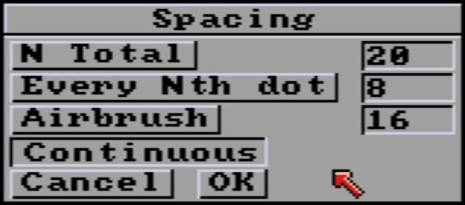

# Spacing options

_needs proofreading by Mark..._

- [N Total](#n-total)
- [Every Nth dot](#every-nth-dot)
- [Airbrush](#airbrush)
- [Continuous](#continuous)

  
Spacing options. Thoses options makes more sense with custom brush, otherwise it just looks like dotted lines. **Continuous** is default drawing mode.

## N Total
Defines the total number of times the current brush will be copied along the path. For example, if you draw a circle with a **total spacing** of 14 with a star-shaped brush, this will make a round of 14 stars.

  
Combined with the [Cycle](mode.md#cycle) mode using a color range, gives this kind of effect.

*Note: Since the polygon tool can't know how many lines you're going to draw, it transfers the total to each polygon segment.*

## Every Nth dot

Do a bit of the same thing, but with regular N-pixel spacing between each drawing, whatever the length of the line, the size of the rectangle and so on.

*Note: The default spacing of 8 pixels can be covered by brushes larger than 8 pixels.*

## Airbrush

Airbrush paints using the airbrush tool along the path defined by any tool affected by the Spacing requester. The number '16' sets the number of airbrush sprays to be applied at each pixel along the path. We recommend lowering it to 6 to 8 to better understand the effect. This creates a fuzzy line or shape. You can use this feature with the painting modes from the [Modes](mode.md) menu to create interesting
effects. For example, using Smooth, Smear, Tint or Cycle with the Airbrush spacing can create thoses interesting  textured effects.  

## Continuous

Default operation. Brush paints continuously, without spacing.

---

From left to right, examples of the 4 default settings, with Circle, Rectangle and Line tools, each with a different brush (indicated in red).  

