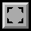
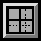

# Tool bar

Welcome to the heart of **PyDPainter** and, before it, **Deluxe Paint**. Long before the toolbar became an obvious standard in graphics software, DPaint provided an efficient interface.

  

A mouse **left-click** on a tool selects it directly. A **right-click** brings up the tool's options. Finally, the tool itself can be halved diagonally, providing a variant - usually the same shape, but filled in. These options are backed up by very short keyboard shortcuts (a single letter), the capital letter of which brings up the variant or the options.

- [Default brushes](#default-brushes)
- [Stencil](#stencil)
- [Dot tool](#dot-tool)
- [Draw/Area tool](#draw-/-area-tool)
- [Line tool](#line-tool)
- [Curve tool](#curve-tool)
- [Fill tool](#fill-tool)
- [Airbrush tool](#airbrush-tool)
- [Rectangle tool](#rectangle-tool)
- [Circle tool](#circle-tool)
- [Ellipse tool](#ellipse-tool)
- [Polygon tool](#polygon-tool)
- [Brush tool](#brush-tool)
- [Text tool](#text-tool)
- [Grid](#grid)
- [Symmetry](#symmetry)
- [Magnifier](#magnifier)
- [Zoom magnifier in/out](#zoom-magnifier)
- [Undo/redo](#undo-redo)
- [Clear canvas](#clear-canvas)

## Default brushes

Here you can choose a pre-defined brush from ten built-in brushes: four round ones, four square ones, and two made up of a
number of separate pixels.  
*Note that their size can be changed quickly, even while drawing, and without enlarging the pixels.*  
For example, with the usual brush shortcuts: `H` to double the size, the `+`  and `-` keys to enlarge and reduce.

On opening, **PydPainter** will propose a single pixel (a dot) as the default drawing brush. You can quickly return to this by using the `.` shortcut on the numeric keypad.

## Dot tool

The Dotted Freehand Tool allows fast freehand drawing. Note, however, **that the faster you go, the bigger the gaps in your drawing**. It can be handy to use and see the shape of a customized brush. Try drawing with it using some of the other brushes to get a feeling for how it works.

  
Speed and brush shape alters the line appearance.

Holding down the `SHIFT` key while painting constrains the tool to move either horizontally or vertically, depending on the direction you move the cursor immediately after pressing `SHIFT`.

Key: `s`

## Draw / Area tool

The Continuous Draw tool produces unbroken lines. Don't forget that you can use any brush or your own brushes.

Press the `SHIFT` key for a horizontal or vertical line constraint.

_Note: In the past, real Amiga software would have slowed down with mouse movements that were too fast and brushes that were too large, but this is no longer the case._

Key: `d`

### Filled Area or freehand shapes filled ###

Allows you to draw a freehand area with the mouse, which will then be filled with the foreground color.This time, when you release the mouse button, the shape you paint is filled with either the foreground or background color, depending on which mouse button you press when you paint the shape. If you release the mouse button before you close the shape, **PyDPainter** closes the
shape for you with a straight line from your cursor position to where you
began the shape.

Current brush is ignored.

Key: `D`

  

_Tip: Draw a shape that intersects itself for an interesting effect of unfilled holes. You can fill with background color, drawing with the right button._

## Line tool

Draws straight lines by clicking and dragging the mouse.
First click once and hold for the origin of the line, then move the mouse and click again to draw the line.
Press the `SHIFT` key for a horizontal or vertical line constraint.

This tool can be used in conjunction with custom Brushs and Modes. With the `CTRL` key held down, the tool leaves traces between the two clicks.

Key: `v`

Right-click tool to open [Spacing](spacing.md).
## Curve tool

Draws curved lines between two points :  
- anchor the curve by pressing the mouse button. Hold the button.
- Drag it to the point where you want the curve to end, and release the button.
- Now, as you move the mouse away from the end points, you'll notice
that the line is still "active," behaving as though it were a rubber band
attached to the cross-hair. Accordingly, the line will curve to follow the
cross-hair wherever you drag it.
- As soon as the curve is the right shape, click the mouse button to
freeze it at that position.

*This tool is not compatible with traces.* Use `Shift` or the [Grid](#grid) for aligned anchor points.

Key: `q`

Right-click tool to open [Spacing](spacing.md).

## Fill tool

Click the icon with the left button, move the cursor (which now looks like a paint can) to an enclosed shape.
You can fill the shape with the current foreground color by clicking the
left button, and with the current background color by clicking the right
button.

*Note that the Fill tool fills all the way to the boundaries of an enclosed shape. If the shape is not completely enclosed (that is, if there is a hole in its perimeter), the paint will "leak" through and fill the entire page.*

Key: `f`
Right-click tool to open Fill type.
## Airbrush tool

By using the Airbrush in combination with the different
brushes, you can create a variety of effects, ranging from a fine one-pixel
spray to a coarse spray made with the big brushes.

Click the Airbrush icon with the left button, and then try painting
with it using the various brushes. Try it with the three- and five-pixel brushes, and then try it with the big
brushes. *Note that, just like a regular airbrush, if you keep the mouse
button pressed without moving the mouse, the paint continues to build
up in one spot.*

Right-click tool to resize nozzle size.  
Press the `SHIFT` key for a horizontal or vertical line constraint.
Press the `CTRL` key to slow down the Airbrush flow rate.

## Rectangle tool

The Rectangle Tool lets you draw squares or rectangles, either unfilled
or filled with the current brush or background color.
- Click to define a corner origin, and hold down the mouse button.
- Move the mouse freely, including to the other side, and click when you like the shape. 

In any case, the rectangle is completed as soon as you release the button.

*Remember, top left for unfilled, and bottom right for filled shapes.*

Key: `r`

Right-click tool to open [Spacing](spacing.md) or Fill type.

## Circle tool

Press and drag with the left button to create a circle with the current foreground color, or with the right mouse button to create a circle bordered or filled with the current background color. Hold down the button and release when you're happy with the shape.

*Note: circles are painted from the center outward, so it's easy to put a circle around anything just by starting to paint from where you want the center of the circle.*

Key: `c`

Right-click tool to open [Spacing](spacing.md) or Fill type.

## Ellipse tool

The Ellipse Tool works just like the [Circle tool](#circle-tool), except that it is still "active" after you release the mouse button. Try it.

Click the icon with the left mouse button (remember, top left for unfilled, and bottom right for filled shapes), move the pointer to the painting area, and draw an ellipse by dragging the mouse. Now release the button.
Note that even though you have released the button, the ellipse contin-
ues to change shape as you drag the mouse around.
- As soon as your ellipse is just the right shape and size, press down
the mouse button and hold it there.
- Now you can rotate your ellipse until it has just the right tilt.
Move your cursor around the ellipse with the mouse button still
held down and watch your ellipse rotate. When it is in just the right
position, release the mouse button.

Key: `e`

Right-click tool to open [Spacing](spacing.md) or Fill type.

## Polygon tool

The Polygon Tool lets you keep drawing straight lines until you have
created a closed figure. Here's how it works:

- Click the button once to anchor the starting point of your polygon and then a second time to complete the first line, as if you were using the Straight [Line tool](#line-tool).
*You will notice that your cross-hair is still connected to the first line by a second straight line.*
- Click the button again to finish that line, and so on until you have
completed your polygon.
The polygon is completed as soon as you click the button with the cross-
hair on your starting point indicated by a square white outline.

Quickly double-click to stop the shape immediately. In fill mode, the shape is automatically closed by a straight line that joins the first point.

*Note: Filled polygonal shapes with intersecting sides create interesting graphic effects.*

Key: `w`

Right-click tool to open [Spacing](spacing.md) or Fill type.

## Brush tool

It's a special tool that is an essential part of **DeluxePaint's** legacy and versatility. With the Brush Selector, anything can be a brush:
 - any piece of artwork, any part of your painting area
 - any text you put on the screen
 - any shape you previously have drawn, even in multiple colors.
 
Step-by-step operation:

1. click on the brush tool
2. the mouse pointer is now extended by two white alignment lines, which are superimposed on any graphics in the drawing area
3. click on a corner of the selection area, **keep the button down**
4. drag the mouse to the opposite corner
5. release the button
6. this area is now your new brush, and you can draw with it!

Not just once, like a stamp, but with all the drawing tools: freehand draw, line, rectangle, circle and even ellipse! Experiment with different brush shapes and stroke tools to understand the power and simplicity of the brush tool.

There's a special [Brush](brush.md) menu, with dedicated effects and functions.

*When you think you've done the trick, try the [Matte](mode.md#matte), [Color](mode.md#color) et [Repl](mode.md#repl) modes.*

And the best part: there are also **Fill Type** that use the brush as a pattern! More on that later.

  
For greater precision, you can click on the brush tool a second time (or press  `b` again) to switch to a polygonal brush tool. It works in the same way as the Polygon tool, but to delimit the area to be captured as a brush. Note that in Replace mode, the stamp remains rectangular.

### Transparency of brushs ###
However, there is one aspect of brush selection you should be aware of: if any parts of your brush consist of the current background color, those parts will be transparent. In other words, whenever you pick up a brush, it's as if you are picking up only the non-background colors; any background colors in the brush will remain invisible even after you change to a new background color. This means that you can create brushes with intricate outlines without fear of picking up a rectangle of the surrounding background color.

*Tip: What's more, if you delimit a brush on the screen, but this time by clicking with the right mouse button, this will erase what you've taken as a brush from the screen. This allows you to move blocks of graphics quickly.*

Key: `b`
## Text tool

Text tool lets you place text anywhere on the page, and the Brush Selector lets you pick it up and reposition it if you didn't have it quite right the first time.
To enter text on the page:
1. Click the Text tool
2. Move the cursor to the page and click where you want to start typing text. (This leaves the text cursor on the page.)
3. Now type on the keyboard
4. Press Enter to move to next line
5. Click elsewhere to start again
6. Press **ESC** or select another tool to quit text.

The text will "wrap" around to the next line when it reaches the end of
the line, or you can press Return to start a new line directly below the
point where you first placed the cursor. If the page size is larger than the
screen, the screen will scroll to the edge of the page as you type. You can
delete text by using the **`Backspace`** key.
Note, however, that if after entering a portion of text you click the cursor elsewhere on the screen, or you select a tool from the Toolbox, that text becomes a bit-mapped image, and no longer behaves as text. In other words, you cannot **`Backspace`** over it as you could when it was still active as text.
You can change the color of your text by choosing a different foreground
color.

---

If you right-click on the text tool, you'll access some obvious options, including choosing a font.

**AA** is depressed by default, for **anti-aliasing**. For a more pixelated effect, remove it. Please note that "bitmap" fonts are no longer a common standard, so don't hesitate to install some from these sites:

[Workbench Topaz](https://www.sblendorio.eu/Misc/TopazFont)

[Bitmap on Dafont](https://www.dafont.com/bitmap.php)

[Fontstruct](https://fontstruct.com/gallery/tag/707/Amiga?category=any)

Note their approximate size, and enter it in the **"Size"** field. 8 is a good default size for legacy bitmap fonts.

*ColorFont and AmigaFont are not yet supported.*  

Key: `t`
## Grid

Key: `g`
## Symmetry

Key: `/`
## Magnifier

Key: `m`
## Zoom magnifier in/out

Keys: `>` / `<`
## Undo/redo

Keys: `u` / `U`
## Clear canvas

Key: `K`
