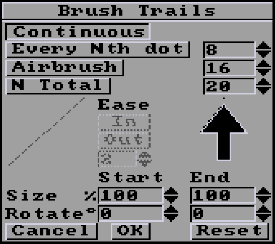
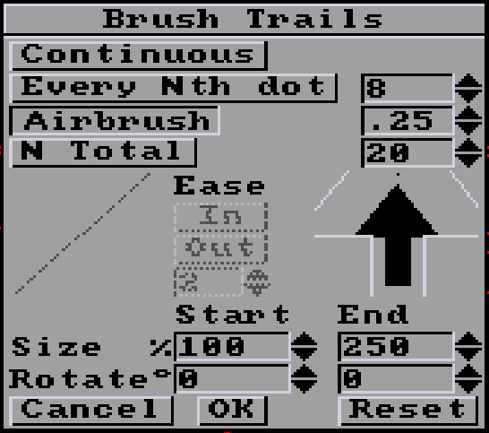
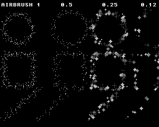

# Brush Trails
- [Brush Trails](#brush-trails)
    - [New in version 2.1.0](#new-in-version-210)
  - [Continuous](#continuous)
  - [Every Nth dot](#every-nth-dot)
  - [Airbrush](#airbrush)
    - [New decimal values in version 2.1.0](#new-decimal-values-in-version-210)
    - [New 2.2.0 Size and Rotate values](#new-220-size-and-rotate-values)
  - [N Total](#n-total)
          - [Documentation written by Stephane Anquetil](#documentation-written-by-stephane-anquetil)

|  |
| :-----: |
| *These options make more sense with a custom brush, otherwise it just looks like dotted lines.* |

### New in version 2.1.0 

Number spinners: Click the up or down arrows to increment or decrement values. Holding the button causes them to repeat.

## Continuous
Default operation. Brush paints continuously without spacing.

## Every Nth dot

Defines the regular pixel spacing between each time the current brush will be copied along the path. This spacing remains the same whatever the length of the line, the size of the rectangle and so on.

*Note: The default spacing of 8 pixels can be covered by brushes larger than 8 pixels.*

## Airbrush
Airbrush paints using the airbrush tool along the path defined by any drawing tool affected by thoses settings (**Line, Curve, Rectangle, Circle, Elipse,** and **Draw**). The number '16' by default sets the number of airbrush sprays to be applied at each pixel along the path. We recommend lowering it to 1 to 4 to better understand the effect. This creates a fuzzy line or shape.  The **spraying size** defined by a right-click on the regular **Airbrush** tool is supported.

*Note: The Airbrush settings apply to all the drawing tools, not the Airbrush tool. Use the **Draw** drawing tool for a free drawing.*

### New decimal values in version 2.1.0 
Airbrush values between 0 and 1 are now accepted. The first aim is to be able to reduce the spray flow sufficiently to use the new Anim Brush function. But it can be useful with normal brushes too.

Use the number spinners to decrement value to 1. Starting at 1, each click down will halve the value (0.5,0.25,0.12...). Each up-click doubles the value up to 1. Beyond 1, the 1-by-1 incrementing behavior returns.

In the picture above on the right side, you see two examples of the "sparking-star" animbrush with Airbrush values of 0.25 and 0.12 using the circle, rectangle and line tools.
On the left side, there are two examples with the default single pixel brush, at 1 then 0.5. You'll notice that this greatly reduces throughput.

### New 2.2.0 Size and Rotate values 

You can set the new **Size** and **Rotation** parameters to quickly add variety, for example:
Set Size end to 250% will spray your brush up to 2.5 times larger.
Set Rotation from -90° to 90° will create an illusion of chaos with a brush that has a directional sense, like a square, a rock.

## N Total
Defines the total number of times the current brush will be copied along the path. For example, if you draw a circle with a **total spacing** of 14 with a star-shaped brush, this will make a round of 14 stars.

|  |
| :-----: |
| *Combined with the [Cycle](../../menus/src/mode.md#cycle) mode using a color range, gives this kind of effect.* |

*Note: With shapes that have multiple line segments like rectangles and polygons, the N Total property is applied to each line segment.*

---

From left to right, examples of the 4 default settings, with Circle, Rectangle and Line tools, each with a different brush (indicated in red).

###### Documentation written by Stephane Anquetil
