# Fill Type

- [Fill Type](#fill-type)
  - [Solid](#solid)
  - [Brush](#brush)
  - [Wrap](#wrap)
  - [Pattern](#pattern)
  - [AntiAlias \& Smooth](#antialias--smooth)
  - [Gradient](#gradient)
    - [Circular fill](#circular-fill)
    - [Vertical Line](#vertical-line)
    - [Linear Fill](#linear-fill)
    - [Horizontal Line](#horizontal-line)
    - [Vertical and Horizontal Fill](#vertical-and-horizontal-fill)
  - [Gradient direction](#gradient-direction)
  - [Dither](#dither)
    - [No dithering](#no-dithering)
    - [Random](#random)
    - [Check](#check)
    - [Dithering slider on all new patterns.](#dithering-slider-on-all-new-patterns)
    - [2x2](#2x2)
    - [4x4](#4x4)
    - [8x8](#8x8)
    - [Halftone](#halftone)
    - [VertBar](#vertbar)
    - [HorizBar](#horizbar)
  - [Status bar](#status-bar)

Right-clicking the **Fill tool**  or the lower-right half of most drawing tools displays this **Fill Type** requester: 

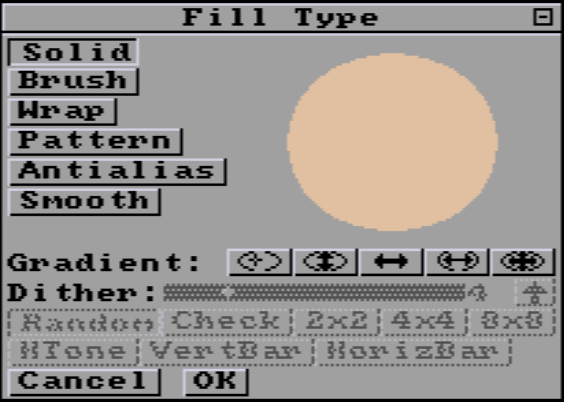

Some buttons are ghosted until you select one of the 5 **Gradient** and most importantly a color which is already in a [range](../../menus/src/palette.md#range.). Select one of the grey color to be sure.
The options in the requester are explained in the following paragraphs.

## Solid

**Solid** fills with the current color with no added effects. If you paint or fill your shape using the left button, the shape is filled with the foreground color. If you paint or fill your shape using the right mouse button, it is filled with the background color (often black). It's the mode by default, if you never open **Fill Type** or used some basic Pixel Art program, you know it.
| 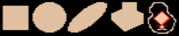 |
| :----: |
| *Filled rectangle, filled circle, filled ellipse, filled polygon, and Fill tool.* |
## Brush

**Brush** fills with the current custom brush and sizes it to fit the filled area.

| 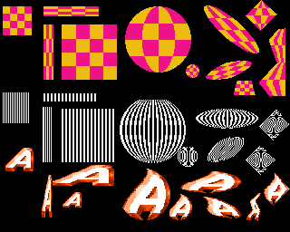 |
| :----: |
| *Three examples of defined brush are on the very left : checkerboard, vertical lines, A letter. Examples of fills in a variety of shapes, from rectangles on the left, to polygons on the right, to circles and inclined ellipses.* |

## Wrap
**Wrap** fills with the current custom brush and adjusts it to the horizontal and vertical shape of the filled area. This gives the illusion of wrapping the brush around a 3D solid. The effect is most pronounced if you use it to fill a shape that is very different from the shape of the custom brush.

*See the comparative examples below.*

## Pattern
**Pattern** fills with a pattern made from current custom brush. It's a "wallpaper" type of filling. There's no stretching, no distortion. It's the patterned fill of early monochrome drawing software.

| 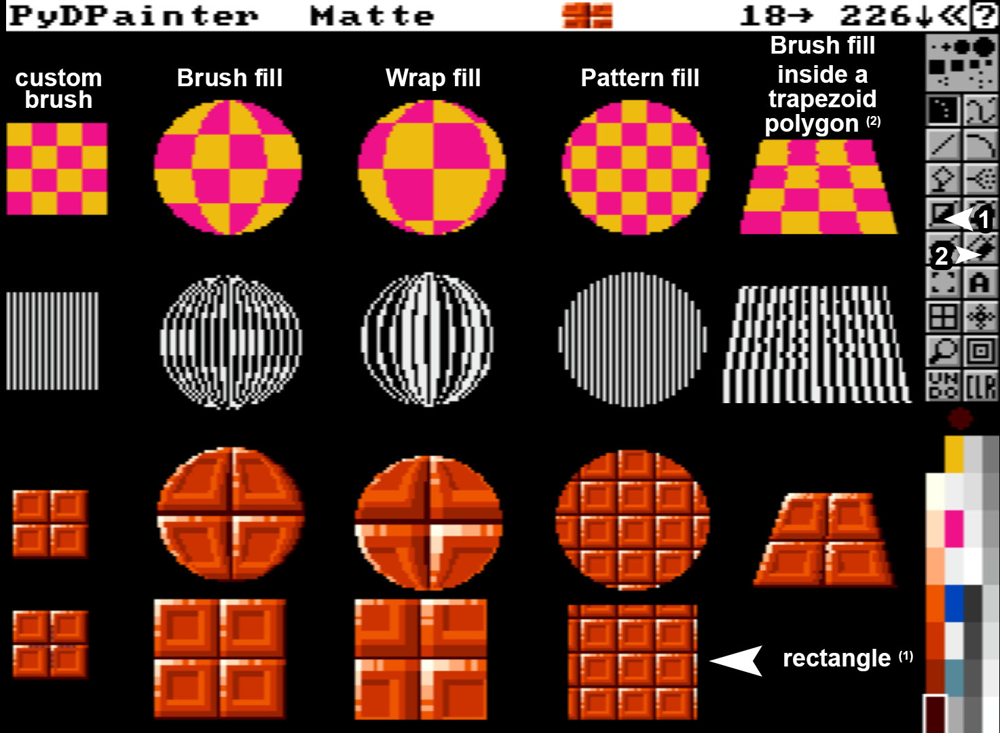 |
| :----: |
| ***Brush*** *respects the original image of the brush.* ***Warp*** *gives interesting effects on rounded shapes. There are no predefined rules: it's up to you to experiment! You can try yourself loading this example file in:* `iff_pics/fill-wrap-comp-ex.iff` |

## AntiAlias & Smooth

The following two modes are new to **PyDPainter**:
* **Smooth** allows you to use the drawing mode of the same name (that of the F8 key) with fill tools. It's a brutal softening, which can give interesting  effects (blur, textures).
* **AntiAliasing** is a more modern mode, which really smoothes the sharp borders of pixels. It's perfect for lettering, diagonal lines or softening the contrast.

*Note that you need an existing design to have a visible effect.*

| 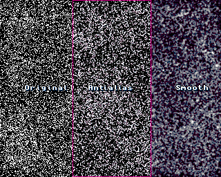 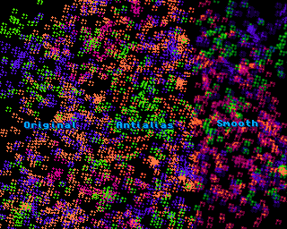 |
| :----: |
| *Some **AntiAliasing** and **Smooth** examples. **Original** here, can be quickly redone with the Airbrush tool; 5-points random brush in various colors.* |

Note that with a limited palette of 16 or less, the performance of these two modes will depend on the color values available in the palette.
If you're smoothing red on a black background, but no dark red/brown color is available, **PyDPainter** will do its best by using purple and dark grays. Under no circumstances will it alter the palette for you. 

## Gradient

**Gradient** Fills offer a host of creative uses. Their rendering will depend as much on the colors range chosen in the [palette](../../menus/src/palette.md), the shapes drawn, as on the options selected here.

| 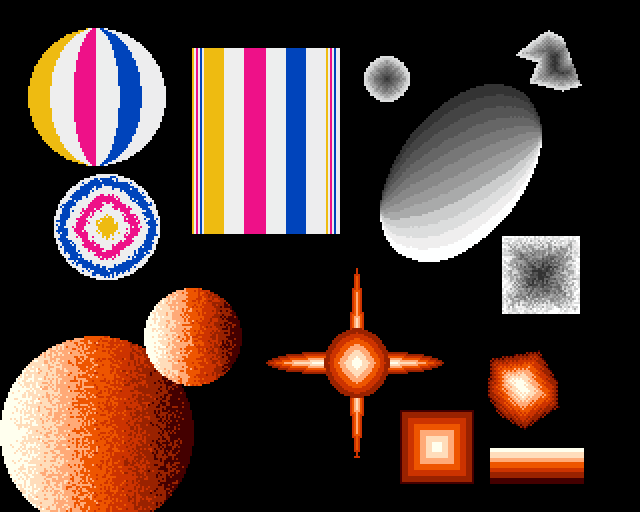 |
| :----: |
| *Examples with a suite of 6 colors (3 bright yellow, cyan, blue and 3 white), a 7-color orange gradient and the default grayscale (12 colors).* |

**Remember to select one of the [Range](../../menus/src/palette.md#range) colors as foreground color to select your gradient and get this type of preview.**
| 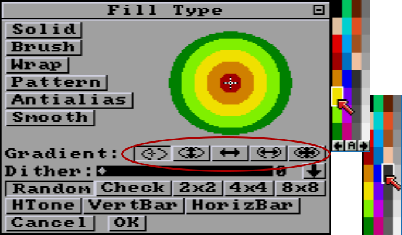 |
| :----: |
| *Select one of the **Gradient** options by clicking its icon with the left mouse button. Select yellow of any gray on default to choose one of default color range. Preview will update automatically.* |

### Circular fill
**Circular fill** paints the gradient as concentric circles, from center to borders with an even distribution without regard to the shape of the object.

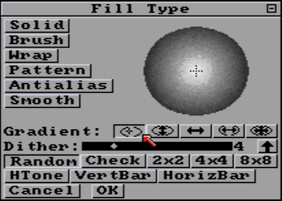
You can adjust the center of circular dragging the crosshair. It can achieve a nice 3D "ball" effect.
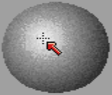

### Vertical Line
**Vertical Line** fill paints the gradient top-to-bottom adjusting the gradient so that it follows the contours of the shape being filled.
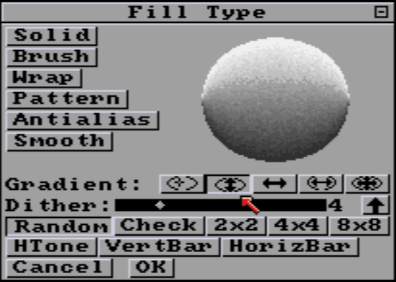
### Linear Fill
**Linear fill** paints the gradient in a line, **according to the angle defined**, with an even distribution without regard to the shape of the object.

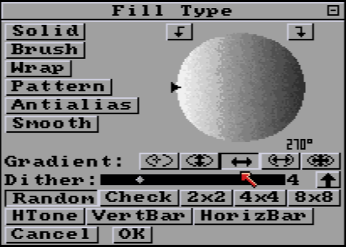
Introduced in PydPainter 2.1.1, the 2 square-shaped arrows above allows you to quickly rotate by 45° clockwise or anticlockwise. But you can rotate freely by 1° using the triangular arrow.
### Horizontal Line
**Horizontal Line** fill paints the gradient left-to-right adjusting the gradient so that it follows the contours of the shape being filled.

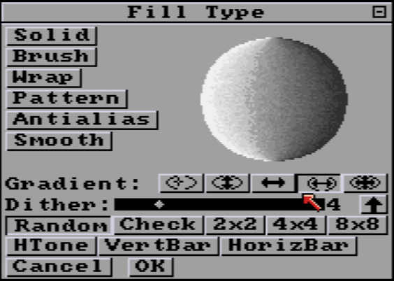

### Vertical and Horizontal Fill 
**Vertical and Horizontal** fill paints the gradient from the inside out adjusting the gradient so that it follows the contours of the shape being filled.
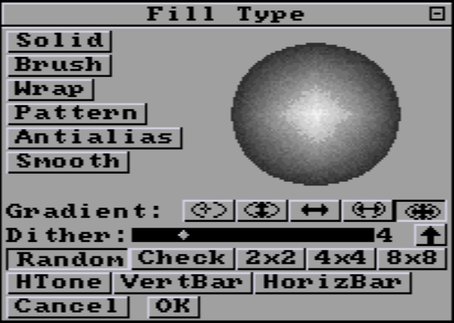
*The preview uses the shape of a circle, but remember that the fill tools can fill the whole screen and any type of shape.*

## Gradient direction
**New in PydPainter 2.1.0**: right to the Dither bar, there is an new black arrow that toggles the gradient orientation. Not the gradient up and down direction, but the order of the colors inside a range.
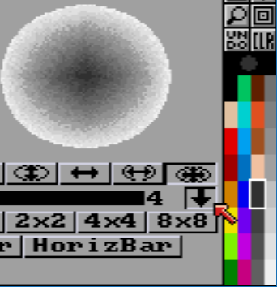
This orientation is first defined by the color order in the **Palette** (`P`). It can now be reversed with a click directly from here. If you have a light to dark grey range in the Palette, and want to use a dark to light grey gradient, just click that arrow.

## Dither

Dithering is the blending of pixels within a **Range** defined in Palette. Usually, it's a gradient, but it doesn't have to be. It can be ordered dithering or a random dithering setting from none to increasingly blended. **PyDPainter 2.2.1** introduce a lot of **new dithering patterns**.

### No dithering

If you don't want to use dithering, set the **Dither** slider to **0**. Pull the **Dither** slider all the way to the left to use this quasi-geometric rasterization. It works with any dithering type selected.

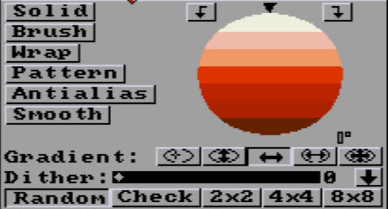

### Random
It's a legacy from Deluxe Paint.
The further the **Dither** slider is pulled to the right, the stronger the blend. Values range from 1 (very light) to 20 (a mishmash of colors).

Dither 2. The beginning of natural randomness.

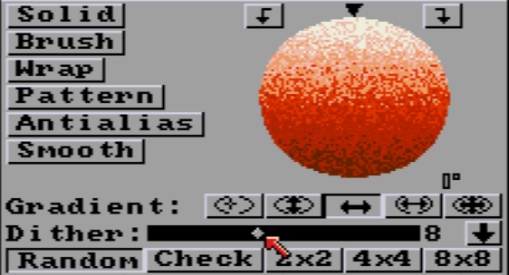

Dither at 8. More of a mixture, it can be used as a base for coloring rocks or plants.

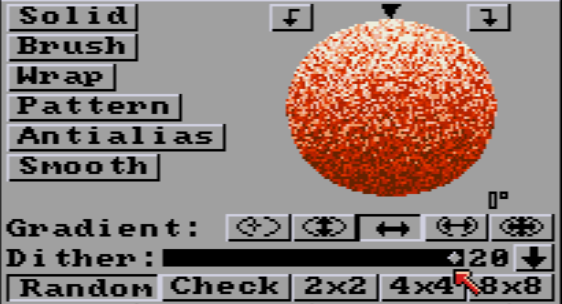

Max dithering is 20. The gradient is barely recognizable. Can be used as a noise base before using other drawing modes such as Smooth or Blend.

### Check
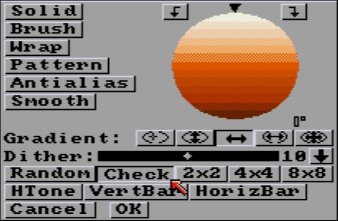
A basic checkerboard pattern.

### Dithering slider on all new patterns.
The Dither slider adjust the pattern size beetween the colors. 0 is always no dithering,1 the minimum, 20 the max. 10 is the new default. It is a relative value, the real pattern is drawn when you fill an actual shape. So a small shape will not render the same gradient as the whole screen.
### 2x2
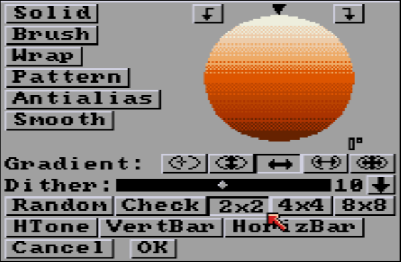
A elegant bayer diffusion.

### 4x4

It's another legacy from Deluxe Paint. If you search for the same pattern as DPaint or previous versions of PyDPainter, use 4x4 with a 13 Dither value. 

### 8x8

The more complex Bayer diffusion 8x8 pattern. It need some place to draw it's pixels pattern entirely.
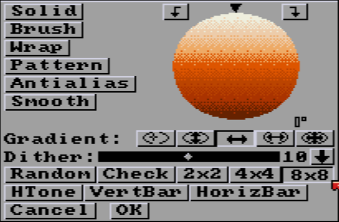
### Halftone

A well-know and recognizable pattern from the printing industry. May require some place to be nice-looking. Produce nice aquatic effect when stretched out to large Dither value. *Experiment !*
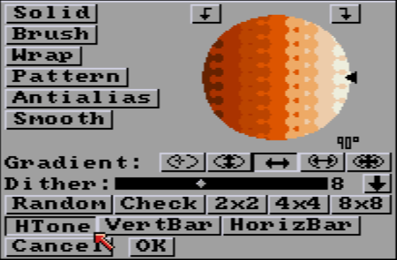

### VertBar
May look strange. It's a pattern designed for vertical gradient. So click to Linear Fill and choose a 90° or 270° angle. Of course, you can use it as a creative way with other fill or angle, if you like theses saw shapes.
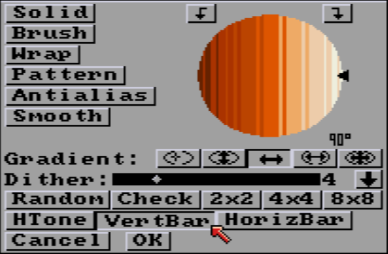

### HorizBar
May look strange. It's a pattern designed for horizontal gradient, like a sky. So click to Linear Fill and choose a 0° or 180° angle. Of course, you can use it in a creative way with other fill or angle, if you like theses saw shapes.
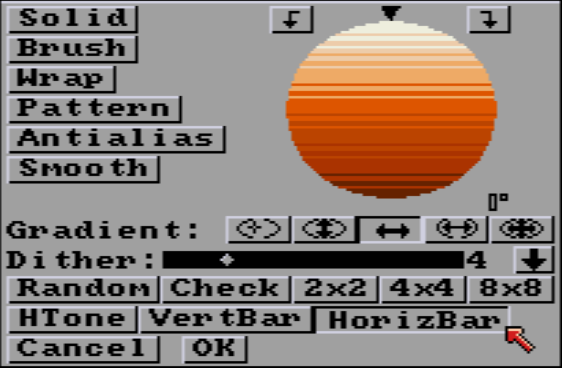
*Tip: Set **Dither** value at 2 to produce a basic line alternate with Vert or Horiz Bar which is interesting in any Gradient type.*
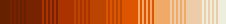
## Status bar
When you return to the painting screen after choosing a fill type :
- the current **Gradient** and its orientation,
- and it's dithering pattern or
- current brush fill, if **Pattern** or **Wrap** are selected
- **AntiAlias** or **Smooth** (**AA** or **SM**) type if choosen
are shown in the Color Fill box in the menu bar:

|  |
| :----: |
| *Bar fill status examples.* |

Documentation written by Stephane Anquetil