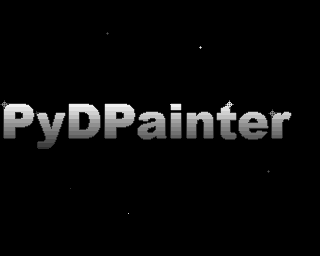
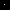
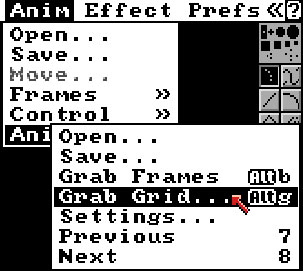
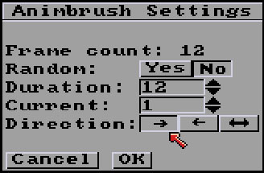
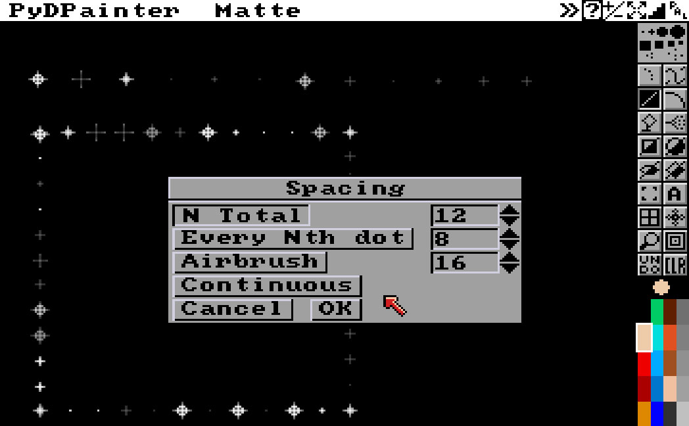
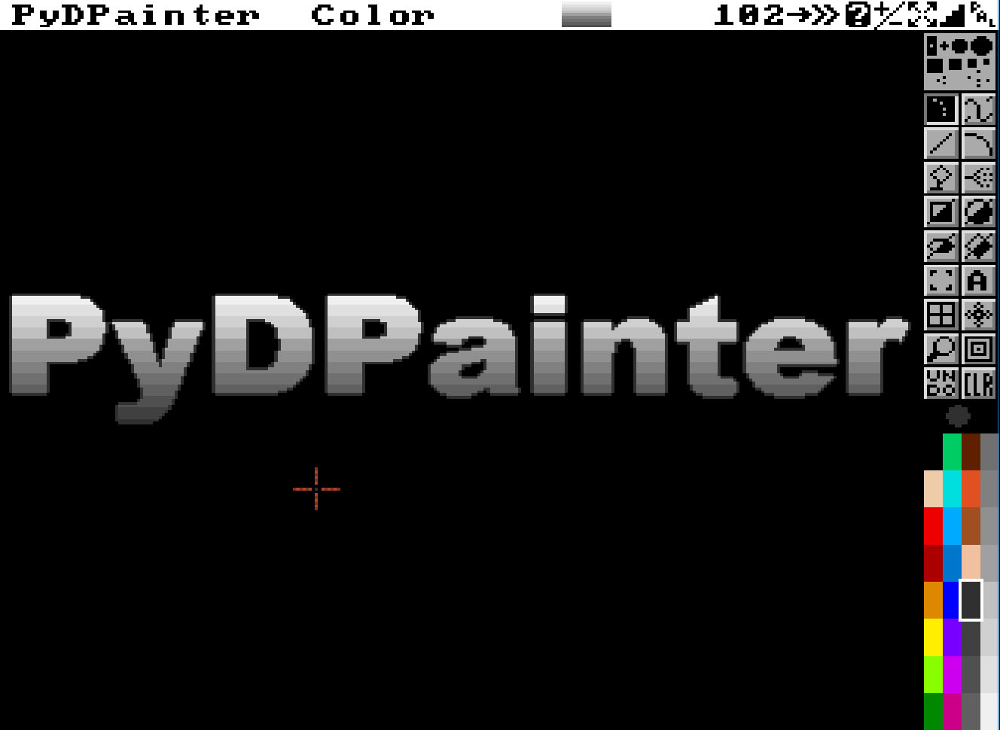
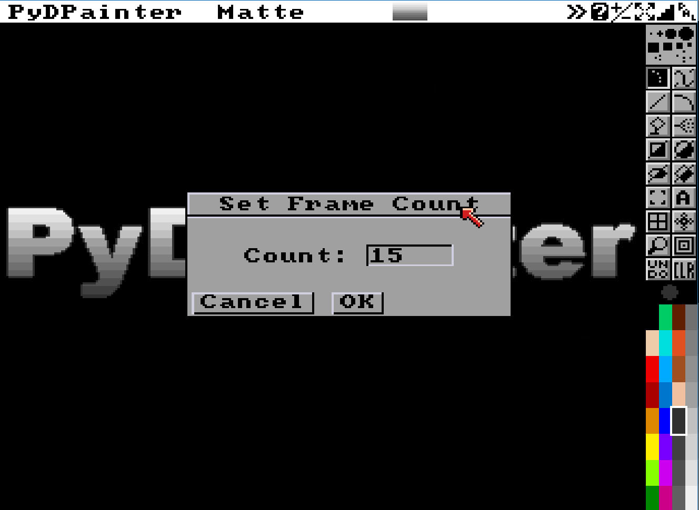
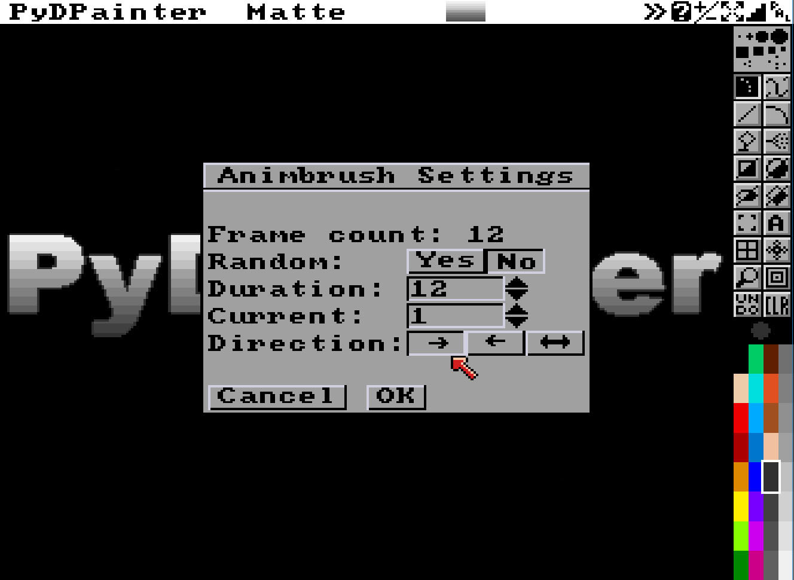
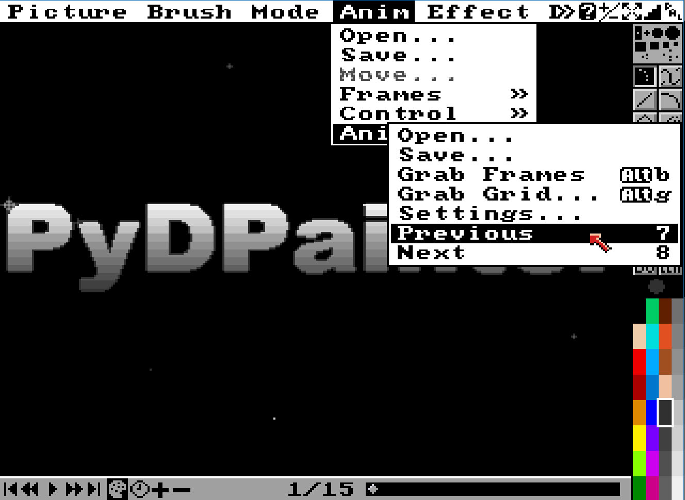
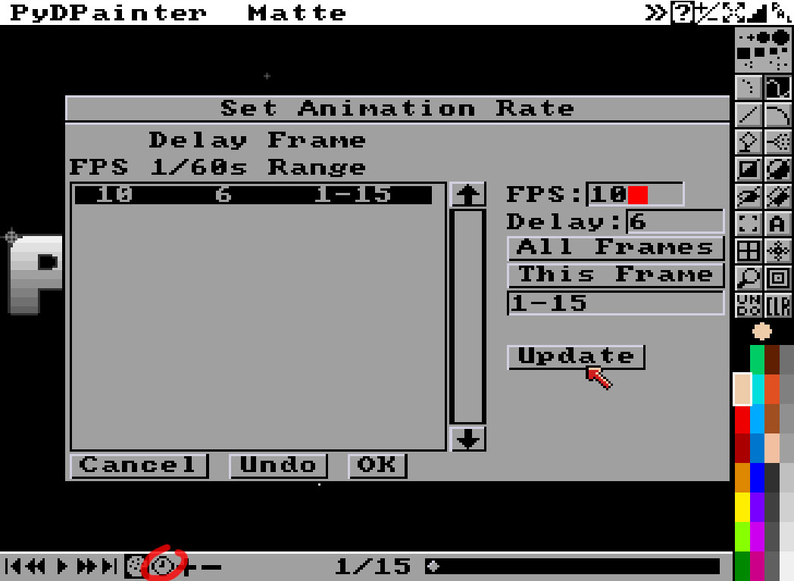

# Animbrush

Let's take a look at the new **Anim Brush** tools.

## The concept

The anim brush concept, although it dates back to Deluxe Paint 3, is still quite original.
The idea is that, just as any portion of the screen can be grabbed like a pencil to draw with (a brush), so too can any part of an animation.

The applications for animated brushes are numerous, and like many of the possibilities offered by the pioneering tools of this era, it's almost up to you to invent the uses.
- Have a tool that lets you copy and paste a reusable part of the animation (a flying bird, a walking cycle, a sparkling star, etc.).
- Think of the animbrush as a brush that changes shape or color sequentially or _(new feature!)_ randomly.

Since **PyDPainter** isn't just a DP3 remake looking back to the past, we've created a number of new features:  
1. **Brush Grid** tool for quick an intelligent conversion of spritesheets and font sheets to animbrushs.  

2. A **Random** option to introduce randomness.
3. More precise decimal parameter adjustment for the **Airbrush** flow. This means you can use the **Airbrush** tool with animbrushes without saturating the drawing too quickly.

## Let it shine!

Enough talk, let's learn how to make this text sparkle with dozens of stars!

### Sparkling star spritesheet

This tutorial uses files provided in the `iff_pics/` folder of the PyDPainter software distribution. Open the `animbrushes-ex.iff` picture file (Use **Picture/Open** menu).

You'll see various examples. These are the stages of a small animation, but juxtaposed side by side horizontally. We'll use the series of 12 images of a star that lights up and goes out.

We're going to “catch” this and turn it into 12 frames for this little animation .

To do this, we'll use the **Grab Grid** function in the **Anim/Anim Brush/Grab Grid...** menu or with the `Alt-g`  shortcut.  

### Brush grid
This opens the **Brush Grid** requestor, where you can enter values with keyboard or numbers spinners or use the visual assistant in the form of a white grid adjustable with the mouse.

 \
*Tip: you can move the requestor if it obscures the area you need to work on. Inside the title bar, a new [-] button lets you collapse it.*

First, let's count the number of sprites you have to grab: from the single white dot to the last single gray dot, via the twinkling star. We've got 12 animation steps - if you look closely, the last one is very dark.
Enter 12 in **Number X**. Let 1 as **Number Y** – Because this tool can also grab graphics in multiple rows or columns.

Move the visual grid with the mouse:
- squares at the corners let you adjust it's size.
- the squares in the center are the grid that will catch the graphics inside and make them the animation frames of our brush. Clicking on them moves the whole thing on the screen. 

Move the grid so that the top left corner is one pixel below the reference line I've deliberately left at the margin of the first star point.

If you don't get it right, you can enter the values shown in the example:  

| ........... | X | Y | 
| Offset: | 26 | 42 | 
| Size: | 10 | 10 | 

_Note that you can click on the arrows of the number spinners to adjust values quickly, while taking a look at the visual grid to see what it does._

The **OK** button validates your settings and saves them. This means you won't lose your precious adjustments if you realize you need to change the background color or adjust a pixel. **Cancel** will cancel your last changes. At the top, the **Reset** button resets all values to default. Useful if you've played with it too much.

When you are done, click **Grab**.

You have the impression that nothing much has happened. However, look at your mouse pointer, it's on a white dot. This is in fact the first frame of the Anim Brush.

_Note: If you fail to capture the animated star at this stage, you can continue this tutorial by loading my pre-made animbrush. I've prepared it for you in the folder `iff_pics/sparkling-star.gif`. Load it from the Menu_ **Anim / Anim Brush / Open…**.

## Use Animbrush on still image

Let's play with it, even on a still image, it can be useful. Hit `j` to switch to **spare screen**.

Use the **Dot** tool  to doodle. With each left click, you'll notice that you've left a star at the next animation stage. For the time being, the sequence is always the same : going forward. Let's change that.
Go to **Anim/Anim Brush/Settings...**
  
In the **Animbrush Settings** windows, you can try to change the **Direction** of the sequence : normal, backward and even "go and go back in reverse". Click thoses arrows, then **Ok** to try and doodle.

Go to **Animbrush Settings** again, and click on **Random: Yes** button. 

Now, each time it is called upon, **PyDPainter** will randomly draw one of the star's states from the 12 animbrush frames. This gives an impression of randomness that you can use with all drawing tools and its spacing parameters (e.g. with **Line**, total N 12).

 Try it with the spray too. Now you can fill the screen with random stars in the blink of an eye!

## A quick logo for animation

_Note: If you know how to createo a quick logo your way, skip this part._

Hit **CLR** icon to clear your screen. In the **text** tool parameter (right-click Text tool), choose a large bold font with width like 36-42. Type some text on screen with one of thoses grey color. Fill it with the preset gradient of grey (make sure a grey color is selected). Use **Fill Settings** with those options:
 \
Vertical Gradient. Dither almost to left at 0 (no noise, no pattern).
_Note the new arrow, which, with one click, changes the direction of the gradient in reference to the “range” defined in the Palette._

Once you're happy with your logo, we're going to make it sparkle with a thousand stars.
## Sparkling logo animation

 We need to recapture or recall the star animbrush. In fact, if you've used or defined another brush at some point, your animbrush is gone. Try one of theses:
- `Shift-B` anyway to recall it.
- Grab it again from the other screen (toggle screens with `j`).
- Load it from the folder `iff_pics/sparkling-star.gif`

This time, we're going to do an animation. Remember that, by default, **PyDPainter** duplicates the current image when you ask it to create several frames. This suits us, because we want to start with this logo everywhere. Go to menu **Anim / Frames Set**. 
Enter 15. It creates a 15-frame animation with your logo in it.

Check in **Animbrush Settings** menu that you are starting from the first animation frame of your animbrush.

**Current:** must be "1".

Check in the animation bar at the bottom that you are starting from the first animation frame : 1/15.

Use Dot tool.  –The first tool in the toolbar.

Position yourself precisely at the top right-hand corner of a letter like the D in the example. Click once without shaking. This drops a pose of the star animation onto the current frame of the animation. Use the `PageDown` key to move to the next frame. Click again (avoid moving the pointer, stay in place at the corner of the letter). Repeat the operation until 12. 

There are 3 frames left without a star at the end, so it's normal to have a short break. Click on “play” icon at the bottom to play the animation and see the result.

Happy ? We're going to reproduce the stars. But to vary the stars so that they don't all twinkle exactly the same, we're going to stagger them in time.

To do this, you need to start from another frame. Either slinding frames at the bottom nav of the global animation, or at the animbrush level, using **Previous / Next** from the **Anim Brush** menu or shortcuts 7 or 8.

Try dropping another star ! 

Now, to save yourself the trouble of hitting `PageDown` 12 times, you can use animpainting.

Place yourself :
- on the desired animation frame (`PageUp/PageDown`)
- on the first star frame (Use `7/8` to come back to a single white dot)
- at the desired position on the screen, preferably on the bright corner of a letter of your logo or in the space.

Hold down the animpainting  key (`Windows`  key or `left-cmd` on Mac), then click twelve times. This drew the star in “motion” over 12 frames. _If the Windows menu pops up at the end, press `Esc` to dismiss it and go back to PydPainter._

All you have to do is experiment and learn to master it !

To fine-tune animation speed, use the clock icon "Set Anim Rate" on the animation toolbar below or **Anim/Control/Set Rate…**  menu.

Lower the **FPS** value. A speed beetween 10 and 20 frame per second is sufficient. Then Click **All Frame** or **Update** and OK.

You can save this animation (the whole screen) using the **Anim/Save…** menu. It can be saved in Animated Gif format for greater convenience on this modern world. Legacy formats like Amiga ANIM5 are avaliable too. Animbrushes must be saved separately in their own menu **Anim / Anim Brush / Save…**.

----
Experiment and have fun!

###### Tutorial written by Stephane Anquetil
