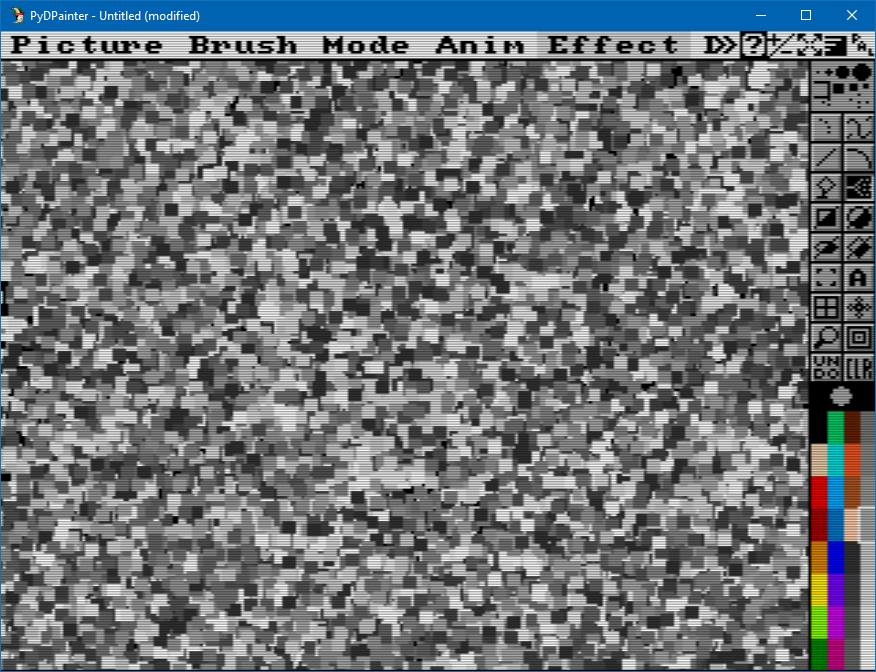
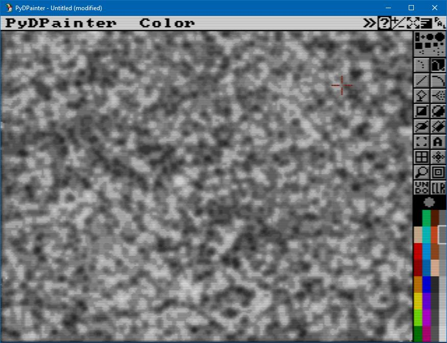
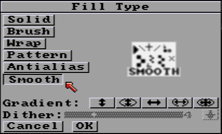
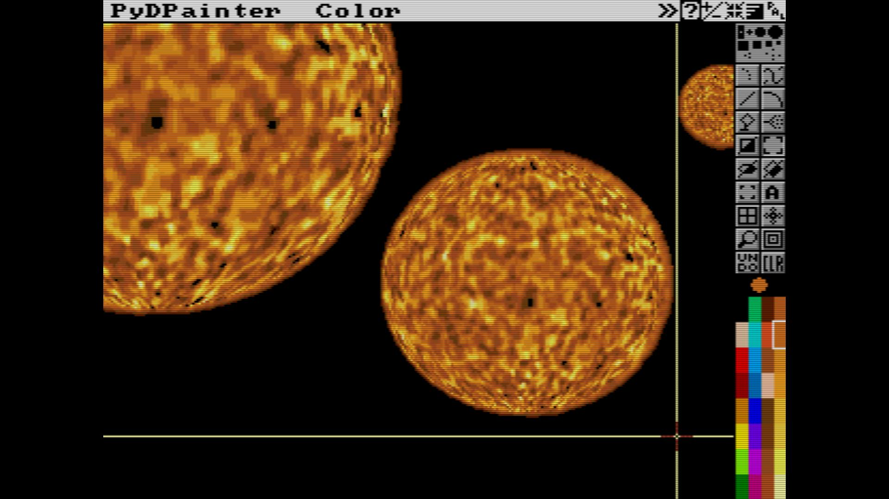

# Cloud and Noise Texture Tutorial

Need a noise or cloud texture like the old filter "Render/Clouds" in PhotoShop?

1. Select a color that is in a color range. Let's use the grays near the end of the default color palette. Click on any gray on the bottom right.

2. Select the **Airbrush** tool (spray icon).

3. Use the menus to select **Mode/Cycle**(or press `F7`). If you paint with this, it will produce random gray dots around your mouse pointer.

4. Select the biggest predefined square brushes.

5. Note how the square brush now have it size displayed in the menu bar *(new in 2.2)*

6. Paint on the canvas to spread a lot of small squares with different shades of gray. Continue to fill the screen like this:

*Tip: You can paint under the tool bar and menus by continuing to hold the mouse button down as you move the airbrush tool into the these areas. But if the tool bar bores you, hit `F10` to hide it.*

6. Hit `TAB` key for fun.
You now have an ophthalmic headache ! Hit `TAB` again to switch off the color cycle.

7. Now we need to blur/smooth this psychedelic pattern. Using **Smooth** Mode the old way or **Smooth Fill** the new way.
___
### The Old way
But in the old **Deluxe Paint** way, you can only paint with this Smooth mode, not fill the whole screen.
- Hit `d` for **Draw** tool. Select the large circle brush on top right.
- Use **Smooth** mode (`F8`)
- Try it out to see what it does. It's smoothing the pixel edges. Since we there are enough color shades in-between available in current palette we get a nice smooth look.
- To paint efficiently, we need a LARGE brush. Enlarge your circle brush using the plus key `+=` or the `shift-H` key to double its size.
- Paint all the screen to smooth with this large brush. You may see the ZZz pointer a bit as PyDPainter works to smooth large areas.
___
When you're done it should look like a screenful of clouds:

### New way using Smooth Fill mode
8. Right click on the **Fill** tool  to open the **Fill Type** settings.

9.  Select **Smooth**. You can now use **Rectangle**, **Circle**, **Ellipse** and **Polygon** filled tools to smooth the area underneath.
10. Use the **Rectangle** tool,  but on the right bottom black half of the icon (Filled !)
11. Draw a large area and observe the result. If your're just drawing a gray rectangle, you do something wrong.
12. Use a large rectangle from up left to bottom right to cover and smmoth the entire screen. 

## Tips

> Smooth Mode is a bit rough sometimes with a large brush. If you want quality anti-aliasing that respects details, you'll have to use the new **AntiAalias Fill**. Or you can smooth with a smaller brush, pixel by pixel to get the right effect. Usually I use the second smallest `+`-shaped circle brush to smooth the edges of objects. This gives a nice blurred look on the edges without blurring too much of the inside of the object.

In the [next tutorial](../plasma/Plasma.md), we'll show you how you can easily draw the Sun, planets, and plasma balls like these:

Back to [Table of content](../../../TOC.md)

###### Tutorial written by Stephane Anquetil

[def]: t