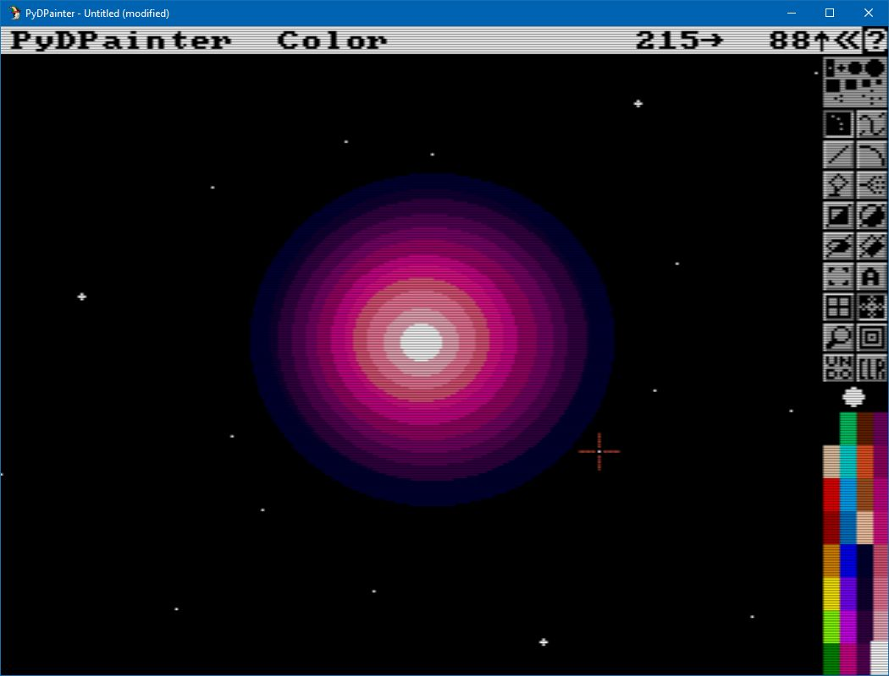
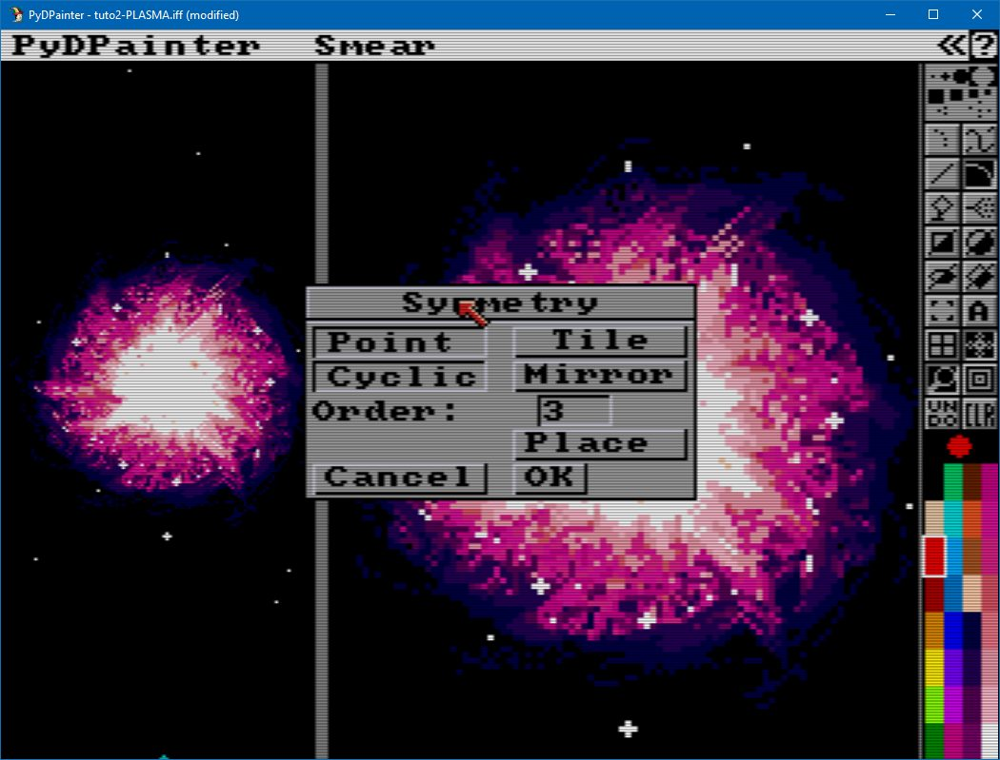
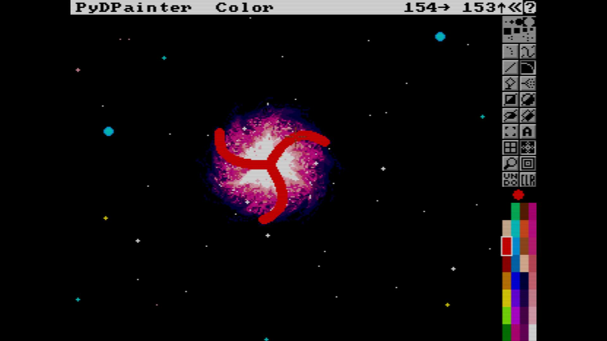
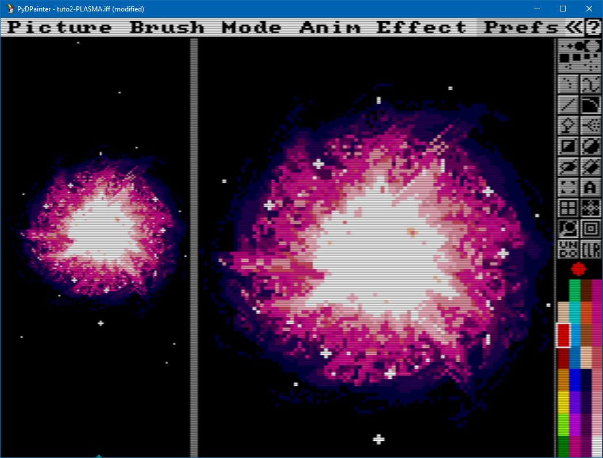

# Galaxy Tutorial

Easily create a galaxy with arms and branches.

1. Customize a range of colors (ie: violet to pink to white).
2. Stack filled circles, from largest to smallest in the center, from darker to lighter using that color range (use keys `[` and `]` )

3. Use Symmetry tool : Cyclic, order 3. Place it in the center of your galaxy.

4. Draw some stars using one pixel and + brush in lighter colors.
5. Use Curve tool, with a medium brush, using Smear mode, draw your arms from the center to outside the last circle area. Repeat at different place. (My exemple is drawn in red Color mode, do the same in Smear Mode)

6. Add some random stars.

And there you go!

You can use same technique to create awesome explosions, using a different color range and the Line tool to smear.

###### Tutorial written by Stephane Anquetil
