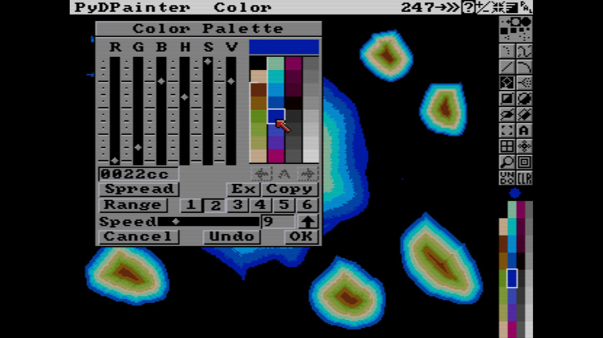
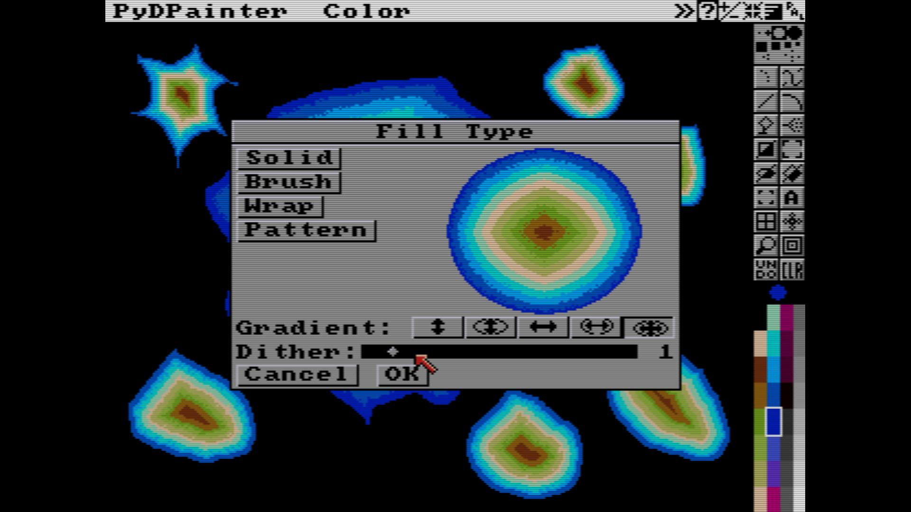
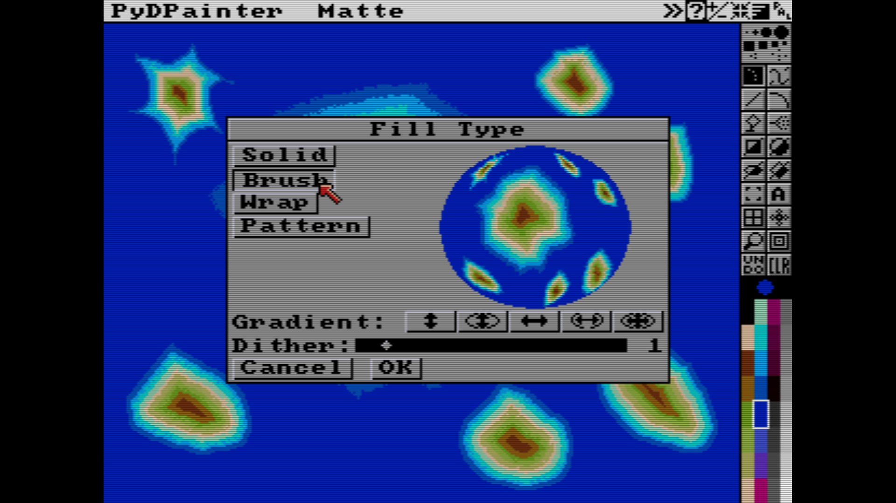
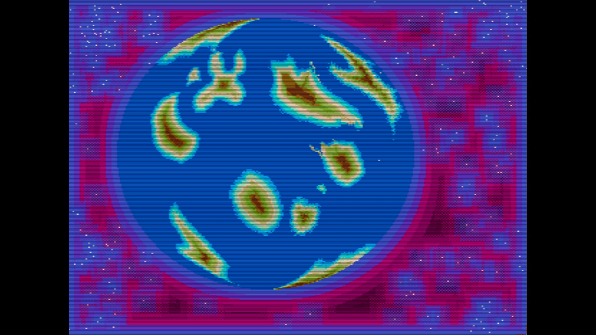

# Planet Tutorial

1. Create a gradient from deep blue water to sand beach to green jungle. Create a new color range.

2. Use Area tool to draw and fill islands with the new 'Fill from center" mode. Restraint yourself in a big squared area.

3. Fill the sea with a (solid fill) blue.
4. Create a big brush with your squared area of 2D islands.
5. Draw/ Fill an Oval with the big brush in "Brush Fill" for a nice planet effect.

PS: Note how another simple "fill from center" generate an amazing background in the space outside, while filling the gap beetween planet, stars and screen borders.

###### Tutorial written by Stephane Anquetil
