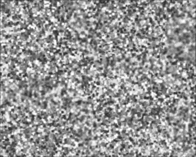
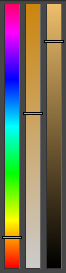
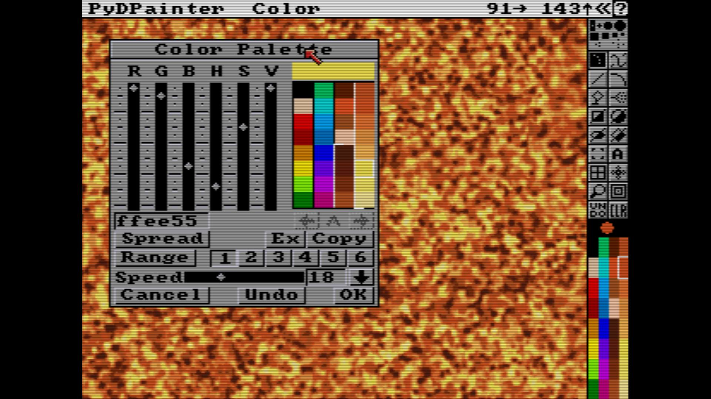
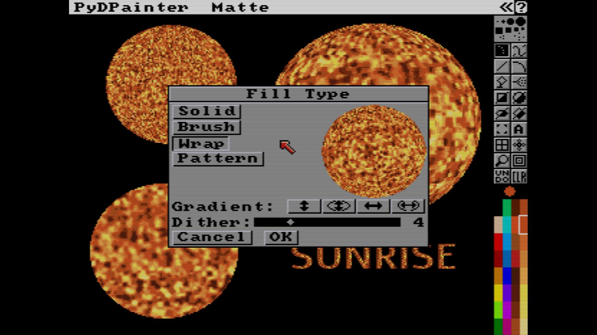
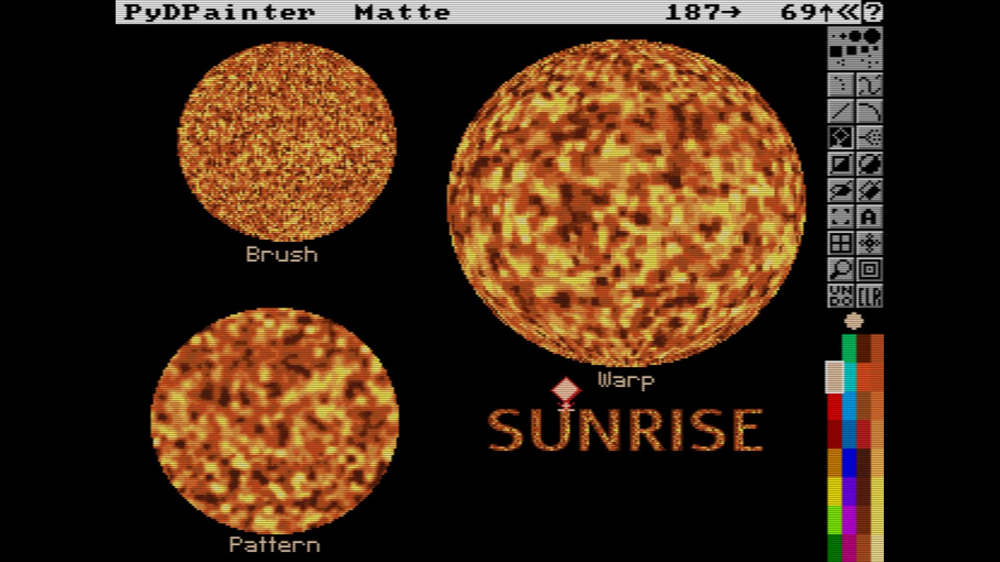

# Plasma Texture Tutorial

This is a continuation of the [Cloud and Noise Texure Tutorial](../clouds/Clouds.md).

We had a grey texture by default. Let's change it for more eye-catching and explosive gradients.

## Change Color Cycle Gradient
- Hit `p` for palette.
- Please note your first range. A white line to the left of the colors of the gray cycle shows you the shades of gray involved.
- For your information, by default, DPaint has a second cycle of 5 colors. Click Range **2** to see it, around the red, yellow and green. Select Range **1** again.
- Click a color to select it (a white frame is around it). Then change the color. The principle is the following:
  
| **H S V** bars | Explanation |
| --- | --- |
| |I advise you to use the **H S V** sliders, it's more graphical. **H** is HUE, the hue. **S** is the SATURATION in color. A saturation at 0 (bottom) is always white. The **V** (VALUE) is more or less dark. At the bottom it is therefore absolute black. If your Value is 0, the saturation is useless. Hue allows you to change the color along the rainbow. The bar ends and starts with red.|
> Later, the programs will visualize this as a color circle, which is more meaningful. But at that time, we had some colors for the interface. Please note that the **PyDPainter** interface is not affected by your change of colors in the Palette. This is a luxury, it was not the case on a real Amiga.
- I advise you to copy an orange in the middle. And a brown in place of the darkest gray in the cycle. Use the **Copy** function for this. Then, with the **Spread** button, create some shading between your colors. Do not hesitate to have well marked colors. Finish your gradient, not with a bright yellow (saturated in S), but with a bucket of yellow tending towards white, thus slightly desaturated. Try to get that visual impression of fire, or of looking at a photoshot of the surface of the sun. See image for reference.

## Let's use this texture to fill shapes and have fun!
- `b` for brush . `F10` key to show/hide the interface if needed.
- Make a rather square selection. It's not necessary to take the whole screen as a brush.
- Press `j`. You have a new working screen to play with your new brush. The "spare" screen. You haven't lost your nice texture. Press `j` to see for yourself.

## Do you want to make suns and plasma?
- Let's go to the circle filling parameters. Right click on the filled part of the circle icon  (the black one on the bottom right).
- You can select three interesting modes that use your brush:
  - Brush
  - Wrap
  - Pattern

- Play with all three, drawing filled circles with them until you understand what it does. Change the **Fill Type** to see the slight differences.
- In **Brush**, the texture is adapted to fill the shape, but with no stretching effect.
- In **Wrap**, the texture is stretched, so the size and shape of the shape affects the visual result. It create this nice pseudo-3D effect.
- In **Pattern**, the texture use the Brush at is, as a repeatable pattern.

Back to [Table of Content](../../../TOC.md)

###### Tutorial written by Stephane Anquetil
